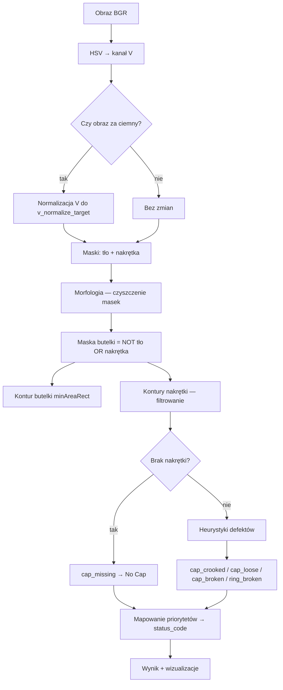
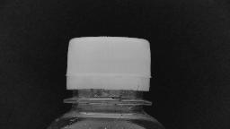
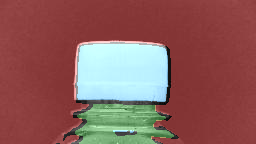
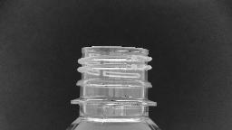
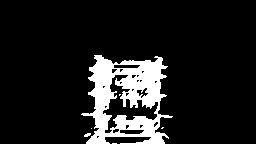
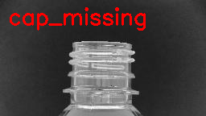
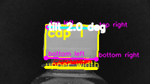
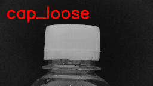

# Classical2 — regułowa analiza nakrętki butelki

Dokument opisuje moduł [`classical/classical_2.py`](../classical/classical_2.py): **co robi, w jakiej kolejności i dlaczego** poszczególne kroki są zastosowane.

Classical2 to **klasyczna metoda widzenia komputerowego** (bez uczenia maszynowego). Analizuje **pełne zdjęcie** butelki, segmentuje tło / butelkę / nakrętkę po jasności, a następnie stosuje **heurystyki geometryczne**, żeby wykryć pięć klas defektów zgodnych z datasetem YOLO.

---

## Spis treści

1. [Cel i założenia](#cel-i-założenia)
2. [Wejście i wyjście](#wejście-i-wyjście)
3. [Przegląd pipeline'u](#przegląd-pipelineu)
4. [Krok po kroku](#krok-po-kroku)
5. [Flagi statusu i klasy](#flagi-statusu-i-klasy)
6. [Parametry](#parametry)
7. [Wizualizacja i raporty](#wizualizacja-i-raporty)
8. [Użycie](#użycie)
9. [Ograniczenia](#ograniczenia)

---

## Cel i założenia

### Po co powstał Classical2?

W projekcie porównujemy trzy podejścia do klasyfikacji nakrętki:

| Podejście | Obraz wejściowy | Idea |
|-----------|-----------------|------|
| HOG + SVM | crop 128×128 z bbox | cechy ręczne + klasyfikator |
| ResNet18 | crop 128×128 z bbox | sieć neuronowa |
| **Classical2** | **pełne zdjęcie** | segmentacja + reguły geometryczne |

Classical2 odpowiada na pytanie: *czy da się rozwiązać zadanie bez treningu, używając wiedzy o kształcie butelki i nakrętki?*

### Kluczowe założenia projektowe

1. **Jasność (kanał V w HSV) rozdziela obiekty** — tło jest ciemne, butelka średnia, nakrętka jasna. To prostsze i stabilniejsze niż pełna segmentacja kolorów przy różnym oświetleniu.
2. **Butelka = wszystko, co nie jest tłem ani nakrętką** — zamiast osobnego progu dla butelki budujemy maskę metodą wykluczenia (mniej parametrów do strojenia).
3. **Wiele słabych sygnałów → jedna klasa** — np. przekrzywiona nakrętka i dziura w masce to oba `Broken Cap`; priorytet reguł rozstrzyga konflikt.
4. **Parametry w JSON (presety)** — progi można zapisywać i testować w GUI bez zmiany kodu.

---

## Wejście i wyjście

### Klasa `Classical2`

```python
from classical.classical_2 import Classical2

analyzer = Classical2()                          # domyślne progi
analyzer = Classical2(params={"angle_thresh_deg": 12.0})  # nadpisanie

result = analyzer.analyze("path/to/image.jpg")   # ścieżka
result = analyzer.analyze(bgr_numpy_array)       # tablica BGR (np. po augmentacji)
```

### Słownik wyniku `result`

| Klucz | Znaczenie |
|-------|-----------|
| `status_list` | lista flag tekstowych, np. `["cap_loose"]` lub `["ok"]` |
| `status_code` | kod klasy 0–4 (patrz [Flagi statusu i klasy](#flagi-statusu-i-klasy)) |
| `measurements` | wartości liczbowe i obiekty pośrednie (maski, linie, regiony) |
| `annotated` | kopia obrazu z nałożonym tekstem statusu |
| `bg_mask`, `bottle_mask`, `cap_mask` | maski binarne do debugowania |
| `hole_contours` | kontury dziur wewnątrz maski nakrętki |

---

## Przegląd pipeline'u



---

## Krok po kroku

### 1. Przygotowanie obrazu (kanał V)

**Co:** Konwersja BGR → HSV, wyciągnięcie kanału **V** (value = jasność).

**Dlaczego:** W datasetcie nakrętka jest wyraźnie jaśniejsza od butelki i tła. Kanał V jest odporniejszy na drobne różnice w odcieniu (H) niż segmentacja w RGB.

**Normalizacja jasności:** Jeśli `max(V) < v_normalize_target` (domyślnie 210), rozciągamy jasność liniowo do tego poziomu. Dzięki temu ciemne zdjęcia nadal trafiają w zakresy progów `bg_v_range` / `cap_v_range` bez ręcznej korekty ekspozycji.



*Kanał V: jasna nakrętka, ciemniejsza butelka i tło — podstawa segmentacji.*

---

### 2. Segmentacja po progach V

**Co:** Trzy zakresy jasności (parametry `bg_v_range`, `bottle_v_range`, `cap_v_range`):

| Zakres | Domyślnie | Rola |
|--------|-----------|------|
| `bg_v_range` | 0–45 | tło |
| `bottle_v_range` | 46–129 | informacyjny (butelka budowana inaczej) |
| `cap_v_range` | 130–255 | nakrętka |

Z `V` tworzymy:

- `raw_bg_mask` — piksele w zakresie tła,
- `cap_mask` — piksele w zakresie nakrętki.

**Dlaczego butelka nie z progu `bottle_v_range`?** Próg butelki bywa zawodny na krawędziach i cieniach. Bezpieczniej: **butelka = complement (tło ∪ nakrętka)** po morfologii — wszystko „w środku" sceny, co nie jest ani tłem, ani nakrętką.



*Tło (czerwone), butelka (zielona) i nakrętka (niebieska) nałożone na oryginał. Widać szczelinę między nakrętką a szyją — sygnał luźnego zamknięcia.*
---

### 3. Morfologia — `_morph_clean`, `_morph_clean2`, `_morph_clean3`

**Co:** Erozja → dylacja → domknięcie (`MORPH_CLOSE`) z eliptycznym jądrem.

**Dlaczego trzy warianty?**

| Funkcja | Zastosowanie | Intencja |
|---------|--------------|----------|
| `_morph_clean` | maska tła | standardowe wygładzenie szumu |
| `_morph_clean3` | maska nakrętki | mocniejsza erozja, bez dylacji — usuwa cienkie mostki między regionami |
| `_morph_clean2` | maska butelki | większe jądro — scala rozproszony kontur butelki |

Morfologia **nie zmienia semantyki** — tylko usuwa szum i dziury po `inRange`, żeby kontury były ciągłe.

---

### 4. Maska tła — jeden dominujący region

**Co:** Z `raw_bg_mask` bierzemy **największy kontur zewnętrzny** i wypełniamy go → `bg_mask`.

**Dlaczego:** Tło często zajmuje większość kadru, ale drobne ciemne plamy (np. cień) tworzą fałszywe kontury. Wybór największego regionu odpowiada typowemu ujęciu: butelka na jednolitym ciemnym tle.

---

### 5. Maska butelki i kontur butelki

**Co:**

```text
bottle_mask = NOT (bg_mask OR cap_mask)
```

Następnie morfologia `_morph_clean2` i `minAreaRect` na największym konturze (jeśli pole > `min_bottle_contour_area`).

**Dlaczego `minAreaRect`?** Daje obrócony prostokąt otaczający butelkę — potrzebny do:

- bounding box `(x, y, w, h)` do pomiarów kontaktu na szyi,
- kąta butelki (zapisany w pomiarach; główna logika crooked opiera się na krawędzi nakrętki, nie na kącie butelki).

---

### 6. Wykrywanie regionów nakrętki

**Co:** Kontury z `cap_mask`, sortowanie po polu malejąco.

**Filtry:**

1. **Minimalne pole** — `cap_relative_area_thresh × pole_obrazu` (domyślnie 5% kadru). Odcina drobne refleksy.
2. **Prostokątność** — `pole_konturu / pole_minAreaRect ≥ cap_rectangularity_thresh`. Nakrętka powinna być zbliżona do prostokąta; nieregularne plamy odrzucamy.
3. **Drugi region** — jeśli drugi kontur ma pole ≥ `second_cap_area_ratio` × pole największego, traktujemy go jako osobny fragment nakrętki (sygnał **pękniętego pierścienia**).

Dla każdego akceptowanego regionu liczymy m.in.:

- `angle_diff_deg` — **nachylenie górnej krawędzi nakrętki względem poziomu obrazu** (nie różnica kątów `minAreaRect` butelki i nakrętki — ta metoda myliła się przy ukośnej linii styku).

**Jak liczymy nachylenie górnej krawędzi:**

1. Z konturu wyciągamy cztery „rogi" heurystyką min/max `(x+y)` i `(x−y)` → `top_left`, `top_right`, itd.
2. Kąt między `top_left` a `top_right` względem poziomej osi obrazu → `_edge_tilt_from_horizontal`.

**Dlaczego nie `minAreaRect` nakrętki?** Prostokąt minimalny ma niejednoznaczność kąta (~90°). Nachylenie **górnej krawędzi** jest bezpośrednio interpretowalne: przekrzywiona nakrętka = duże `angle_diff_deg`.

---

### 7. Ocena defektów (flagi w `status_list`)

Kolejność sprawdzeń w kodzie (wszystkie mogą się kumulować w liście; końcowa klasa wybierana jest osobno — patrz [priorytety](#mapowanie-na-klasę-status_code)).

#### 7.1 Brak nakrętki — `cap_missing`

**Warunek:** Brak konturu po filtrach **lub** stosunek `pole_konturu / pole_wypukłej_otoczki (convex hull) < cap_area_missing_thresh` (domyślnie 0.8).

**Dlaczego convex hull?** Nakrętka powinna wypełniać wypukłą otoczkę. Bardzo „dziurawa" lub resztkowa maska oznacza, że nakrętki praktycznie nie ma — nawet jeśli jakiś mały kontur przeżył filtr pola.



*Oryginalne zdjęcie: widoczne gwinty szyi, brak jasnego regionu nakrętki.*



*Po progu V i morfologii maska nakrętki jest fragmentaryczna — zbyt mała i niewypukła, żeby uznać ją za prawidłową nakrętkę.*



*Końcowa etykieta `cap_missing` → klasa **No Cap** (kod 4).*

#### 7.2 Przekrzywiona nakrętka — `cap_crooked`

**Warunek:** `angle_diff_deg > angle_thresh_deg` (domyślnie 10°).

**Dlaczego klasa Broken Cap?** W datasetcie przekręcenie / złamanie nakrętki jest etykietowane jako *Broken Cap* (kod 0).

#### 7.3 Luźna nakrętka — `cap_loose`

**Warunek:** W górnej części maski butelki mierzymy:

- `bottle_contact_width` — najszerszy odcinek styku w **górnym pasie** wysokości `contact_band_prop × wysokość_bbox` (domyślnie 15%),
- `bottle_upper_width` — najszerszy odcinek w **górnej połowie** butelki (`upper_half_prop`, domyślnie 50%),
- `bottle_contact_prop = contact_width / upper_width`.

Jeśli `bottle_contact_prop < loose_contact_prop_thresh` (domyślnie 0.85) → nakrętka siedzi wąsko na szyi → **Loose Cap**.

**Dlaczego stosunek, a nie absolutna szerokość?** Butelki mają różne skale w kadrze; proporcja kontaktu do szerokości górnej części butelki jest niezależna od rozdzielczości.



*Czerwona linia **contact** (szerokość styku w górnym paśmie szyi) jest wyraźnie krótsza od żółtej **upper width** — stosunek `bottle_contact_prop` spada poniżej progu.*



*Końcowa etykieta `cap_loose` → klasa **Loose Cap** (kod 3).*

#### 7.4 Pęknięty pierścień — `ring_broken`

**Warunki (wystarczy jeden):**

1. **Dwa znaczące regiony nakrętki** — fizyczny podział maski na dwa kawałki.
2. **Różnica kąta górnej i dolnej krawędzi** nakrętki (`cap_edge_angle_diff > ring_edge_angle_thresh`, domyślnie 5°) — górna i dolna krawędź „nie równoległe" jak przy intact ring.

**Dlaczego:** Pierścień nakrętki po pęknięciu często rozpada się na dwa jasne obiekty albo ma niespójną geometrię krawędzi.

#### 7.5 Złamana nakrętka — `cap_broken`

**Warunki (wystarczy jeden):**

1. **Niski stosunek pola do convex hull** — między `cap_area_missing_thresh` a `cap_area_broken_thresh` (domyślnie 0.8–0.95): kształt wyraźnie niewypukły, ale jeszcze wykrywalny.
2. **Dziura w masce nakrętki** — kontury wewnętrzne (`RETR_CCOMP`) wewnątrz największego zewnętrznego konturu; suma pól dziur ≥ `cap_hole_area_prop_thresh × pole_nakrętki` (domyślnie 4%).

**Dlaczego dziury w CCOMP?** Otwór w środku jasnej nakrętki (np. po urwaniu fragmentu) daje wewnętrzny kontur otoczony maską — klasyczny test „donuta".

#### 7.6 Prostość górnej krawędzi (Hough) — pomiar pomocniczy

W ROI wokół bbox nakrętki: Canny → `HoughLinesP`. Sprawdzamy, czy jakaś linia pokrywa ≥ `straight_edge_threshold_ratio` długości górnej krawędzi przy tolerancji kąta `straight_edge_angle_tol`.

**Uwaga:** Wynik trafia do `measurements["cap_top_edge_straight"]` — **nie ustawia osobnej flagi** w `status_list`. Służy diagnostyce w GUI i raportach tekstowych.

#### 7.7 Brak defektów — `ok`

Jeśli po wszystkich testach lista flag jest pusta, dodawane jest `ok` → klasa **Good Cap**.

---

## Flagi statusu i klasy

### Flagi (`status_list`)

| Flaga | Znaczenie |
|-------|-----------|
| `ok` | brak wykrytych defektów |
| `cap_missing` | brak nakrętki lub zbyt mała / rozproszona maska |
| `cap_loose` | wąski styk nakrętki z szyją butelki |
| `cap_broken` | niewypukły kształt lub dziura w masce |
| `ring_broken` | dwa regiony lub niespójne krawędzie pierścienia |
| `cap_crooked` | górna krawędź nachylona względem poziomu |

### Mapowanie na klasę (`status_code`)

**Stała kolejność priorytetów** — pierwsze dopasowanie wygrywa:

| Priorytet | Warunek | Kod | Klasa |
|-----------|---------|-----|-------|
| 1 | `cap_missing` lub brak konturu | **4** | No Cap |
| 2 | `ring_broken` | **1** | Broken Ring |
| 3 | `cap_broken` **lub** `cap_crooked` | **0** | Broken Cap |
| 4 | `cap_loose` | **3** | Loose Cap |
| 5 | inaczej | **2** | Good Cap |

**Dlaczego priorytety?** Jedno zdjęcie może teoretycznie spełniać kilka warunków (np. luźna i lekko przekrzywiona). Dataset i ewaluacja używają **jednej etykiety głównej** — priorytet odzwierciedla kolejność „najbardziej krytycznego" defektu (brak nakrętki > pierścień > złamanie > luźna > OK).

Etykiety czytelne dla człowieka: [`classical/classical2_labels.py`](../classical/classical2_labels.py).

---

## Parametry

Wszystkie progi są w `Classical2.get_default_params()`. Presety JSON w [`classical/presets/`](../classical/presets/) (np. `default.json`, `small_hole.json`) — te same klucze.

### Grupy parametrów

| Grupa | Klucze | Rola |
|-------|--------|------|
| Segmentacja V | `bg_v_range`, `cap_v_range`, `v_normalize_target` | podział tła / nakrętki |
| Morfologia | `kernel_size`, `erode_iter`, `dilate_iter` | czyszczenie masek |
| Nakrętka — detekcja | `cap_relative_area_thresh`, `cap_rectangularity_thresh`, `second_cap_area_ratio` | które kontury liczą się jako nakrętka |
| Butelka | `min_bottle_contour_area`, `contact_band_prop`, `upper_half_prop`, `loose_contact_prop_thresh` | luźna nakrętka |
| Kształt nakrętki | `cap_area_missing_thresh`, `cap_area_broken_thresh`, `cap_hole_area_prop_thresh` | brak / złamanie |
| Geometria | `angle_thresh_deg`, `ring_edge_angle_thresh` | przekrzywienie, pierścień |
| Linie (Hough) | `canny_low`, `canny_high`, `hough_threshold`, `line_length_prop`, `straight_edge_*` | diagnostyka krawędzi |

**Strojenie:** W GUI zakładka *Rule-Based Config & Analyze* — zmiany można zapisać jako preset i uruchomić batch w *Rule-Based Evaluation*.

---

## Wizualizacja i raporty

### `build_analysis_visualizations(result)`

Buduje podglądy BGR:

| Obraz | Zawartość |
|-------|-----------|
| `annotated` | oryginał + tekst flag |
| `background` | maska tła |
| `bottle` | maska butelki + prostokąt `minAreaRect` + linie kontaktu (czerwona) i górnej szerokości (żółta) |
| `cap` | maska nakrętki + prostokąty regionów + górna/dolna krawędź + dziury (czerwony fill) |

### `format_analysis_report` / `write_analysis_report`

Tekstowy raport: predykcja, flagi z opisami, opcjonalnie expected z datasetu i match (correct / partial / incorrect).

### `save_analysis_visualizations` / `save_pipeline_documentation`

Zapisuje `original.jpg`, `annotated.jpg`, `background.jpg`, `bottle.jpg`, `cap.jpg` do wybranego katalogu (domyślnie `classical/result/` przy uruchomieniu CLI).

Funkcja `save_pipeline_documentation` zapisuje ponadto **numerowane kroki pośrednie** (`01_original.png` … `14_annotated.png`) oraz plik `steps_index.txt` z opisami. Ilustracje w tym dokumencie pochodzą z folderów `classical/result/pipeline_steps/loose/` i `missing/` (kopie w [`docs/images/classical2/`](images/classical2/)).

---

## Użycie

### CLI

```bash
python classical/classical_2.py path/to/image.jpg
python classical/classical_2.py path/to/image.jpg --out annotated.png
python classical/classical_2.py path/to/image.jpg --steps-dir classical/result/pipeline_steps/moj_przyklad
```

Wypisuje `status_code` na stdout; wizualizacje lądują w `classical/result/`, a kroki pośrednie w `classical/result/pipeline_steps/<nazwa_obrazu>/` (flaga `--no-steps` wyłącza ten zapis).

### Ewaluacja na datasecie

[`classical/evaluate_classical2.py`](../classical/evaluate_classical2.py) — batch na folderze obrazów z etykietami YOLO, tryby `raw` / `aug` / `both`, eksport błędów i metryk JSON do `results/metrics/`.

### GUI

Zakładki *Rule-Based Config & Analyze* (pojedyncze zdjęcie) i *Rule-Based Evaluation* (cały zbiór) — patrz [`docs/GUI_USER_GUIDE.md`](GUI_USER_GUIDE.md).

### Augmentacja

`analyze()` przyjmuje tablicę NumPy — ten sam pipeline CV działa na zdjęciach po augmentacji (bez zmiany rozdzielczości), co umożliwia test odporności jak w ścieżce ML.

---

## Ograniczenia

1. **Zależność od jasności** — ekstremalne oświetlenie lub nakrętki nietypowych kolorów mogą zepsuć segmentację V; wtedy wszystkie dalsze reguły działają na złych maskach.
2. **Jedna butelka w kadrze** — logika zakłada jeden dominujący kontur butelki i jedną nakrętkę u góry.
3. **Heurystyki, nie gwarancja** — progi są dopasowane do datasetu `bottle-cap.yolov8`; inne domeny wymagają nowych presetów.
4. **Wieloetykietowość datasetu** — przy ocenie porównujemy jeden `status_code` z listą expected; częściowa zgodność (score 0.5) jest obsługiwana w ewaluacji, nie w samym `Classical2`.

---
