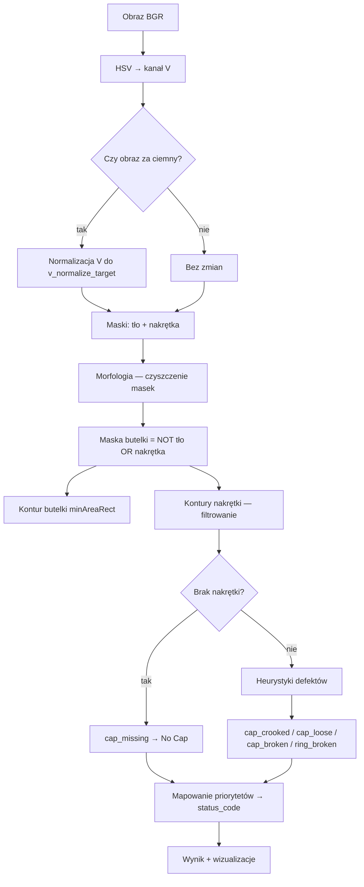

# Projekt Techniki Widzenia maszynowego

**Temat** Kontrola jakości na linii produkcyjnej - zakręcania butelek

**Zespół**  Adam Sokołowski, Antoni Kowalski, Bartosz Jusiak


# Wstęp - Bottle Cap Inspection — klasyka vs. sieci

Prosty prototyp porównujący **klasyczną metodę CV** z **siecią neuronową**
na zadaniu klasyfikacji stanu nakrętki butelki.

| Metoda | Typ | Pipeline |
|---|---|---|
| **HOG + SVM** | klasyczna | gradienty HOG → StandardScaler → LinearSVC (kalibrowany) |
| **ResNet18** | deep learning | transfer learning (ImageNet → fine-tuning ostatniego bloku) |

Porównujemy je na tych samych crop'ach z GT bounding boxów — żeby porównanie
było uczciwe i łatwe do zinterpretowania.

---

## Dataset

- **Źródło:** Roboflow `bottle-cap.yolov8` (639 zdjęć).
- **Klasy (5):** `Broken Cap`, `Broken Ring`, `Good Cap`, `Loose Cap`, `No Cap`.
- Z każdego bounding boxa wycinamy kwadratowy crop (`128 × 128 px`).
- Stratified split 70 / 15 / 15 (train / val / test).

## Augmentacja (raw vs aug)

Każdy model trenujemy **dwa razy**:

- **raw** — sam dataset, bez augmentacji,
- **aug** — dataset + 2 augmentowane kopie (rotacje, blur, szum, jasność, flip).

Dzięki temu w wykresach widać, ile augmentacja faktycznie daje każdej metodzie.

---

## Struktura projektu

```
TWM_project/
├── README.md
├── requirements.txt
├── config.py              <- ścieżki, klasy, seed, hiperparametry
├── run_all.py             <- pipeline: dane → trening → ewaluacja → demo
├── demo.py                <- ładny side-by-side wizualny PNG do prezentacji
│
├── bottle-cap.yolov8/     <- dataset (etykiety + data.yaml; obrazy pobierane)
│
├── data/                  <- przygotowanie danych
│   ├── download_dataset.py
│   ├── dataset_loader.py  <- crop kapsli z GT bbox
│   ├── splitter.py        <- stratified split
│   ├── augmentation.py
│   ├── preprocessing.py
│   └── eda.py
│
├── classical/             <- HOG + SVM
│   ├── base_classifier.py
│   ├── hog_svm.py
│   └── run_classical.py
│
├── ml/                    <- ResNet18 transfer learning
│   ├── base_model.py
│   ├── transfer_learning.py
│   └── run_ml.py
│
├── evaluation/            <- framework porównawczy
│   ├── metrics.py
│   ├── evaluator.py
│   ├── robustness.py
│   ├── compare.py
│   └── infer.py
│
└── results/               <- auto-generowane wyniki
    ├── metrics/
    ├── plots/
    └── models/
```

Obie metody implementują ten sam interfejs (`fit`, `predict`, `predict_proba`,
`save`, `load`), więc framework ewaluacyjny obsługuje je identycznie.

---

## Instalacja

```bash
python -m venv venv
venv\Scripts\activate          # Windows
# source venv/bin/activate     # Linux / macOS
pip install -r requirements.txt
```

Wymagany Python ≥ 3.10. PyTorch instaluje się w wersji CPU; jeśli masz GPU
i chcesz CUDA, doinstaluj wariant ze strony <https://pytorch.org>.

---

## Jak uruchomić

### 1. Pobierz obrazy datasetu

**Opcja A — Roboflow API:**
```bash
setx ROBOFLOW_API_KEY "twoj-klucz"   # Windows, otwórz nowy terminal
python data/download_dataset.py
```

**Opcja B — ręcznie:** wrzuć `.jpg` do `bottle-cap.yolov8/train/images/`
(nazwy muszą zgadzać się z plikami `.txt` w `train/labels/`).

### 2. Cały pipeline jednym strzałem

```bash
python run_all.py                      # raw + aug, oba modele, demo
python run_all.py --augmentation aug   # tylko aug (najszybciej)
```

To uruchamia po kolei: EDA → split → trening obu metod → ewaluacja
→ wykresy → wizualne demo PNG.

### 3. Pojedyncze etapy

```bash
python data/eda.py                     # tylko EDA
python data/splitter.py                # tylko split
python classical/run_classical.py      # tylko HOG+SVM
python ml/run_ml.py                    # tylko ResNet18
python evaluation/compare.py           # tylko agregacja wyników
python demo.py                         # tylko wizualne demo
```

### 4. Inferencja na pojedynczym obrazie

```bash
python -m evaluation.infer --list                              # lista modeli
python -m evaluation.infer --model resnet18_aug --image cap.jpg
python -m evaluation.infer --model hog_svm_aug --folder test/
```

---

## Co zobaczyć w `results/`

Każdy *run* ma nazwę `<method>_<trained_on>`, np. `hog_svm_aug`, `resnet18_raw`.

| Plik | Co tam jest |
|---|---|
| `results/metrics/summary.csv` | tabela porównawcza wszystkich runów |
| `results/metrics/<run>.json` | pełne metryki per run |
| `results/metrics/<run>_robustness.json` | odporność per run (blur, noise, ...) |
| `results/plots/comparison_accuracy.png` | bar chart: Accuracy + F1 macro, raw vs aug |
| `results/plots/comparison_speed.png` | czas inferencji (ms / obraz) |
| `results/plots/augmentation_gain.png` | Δ (aug − raw) per metoda |
| `results/plots/robustness.png` | accuracy pod różnymi zaburzeniami |
| `results/plots/confusion_<run>.png` | macierz pomyłek per run |
| `results/plots/demo_predictions.png` | **wizualne side-by-side demo** (do slajdu) |
| `results/models/<run>.{pkl,pt}` | zapisane wagi |
| `results/models/<run>.meta.json` | metadane: data, hiperparametry, finalne metryki |

---

## Najczęstsze parametry (`config.py`)

- `IMAGE_SIZE` — rozmiar wycinka (128 px).
- `BBOX_PADDING` — ile kontekstu wokół GT bbox (5%).
- `SEED` — ziarno generatora losowego.
- `CNN_EPOCHS`, `CNN_LR`, `BATCH_SIZE` — hiperparametry treningu ResNet18.

---

## Co poza zakresem

- pełny pipeline detekcji (YOLOv8 fine-tuning na całym obrazie),
- aplikacja webowa (Streamlit/Gradio),
- ensemble metod,
- szeroka optymalizacja hiperparametrów.


---
# Classical2 — regułowa analiza nakrętki butelki

Dokument opisuje moduł [`classical/classical_2.py`](../classical/classical_2.py): **co robi, w jakiej kolejności i dlaczego** poszczególne kroki są zastosowane.

Classical2 to **klasyczna metoda widzenia komputerowego** (bez uczenia maszynowego). Analizuje **pełne zdjęcie** butelki, segmentuje tło / butelkę / nakrętkę po jasności, a następnie stosuje **heurystyki geometryczne**, żeby wykryć pięć klas defektów zgodnych z datasetem YOLO.

---

## Spis treści

1. [Cel i założenia](#cel-i-założenia)
2. [Wejście i wyjście](#wejście-i-wyjście)
3. [Przegląd pipeline'u](#przegląd-pipelineu)
4. [Krok po kroku](#krok-po-kroku)
5. [Flagi statusu i klasy](#flagi-statusu-i-klasy)
6. [Parametry](#parametry)
7. [Wizualizacja i raporty](#wizualizacja-i-raporty)
8. [Użycie](#użycie)
9. [Ograniczenia](#ograniczenia)

---

## Cel i założenia

### Po co powstał Classical2?

W projekcie porównujemy trzy podejścia do klasyfikacji nakrętki:

| Podejście | Obraz wejściowy | Idea |
|-----------|-----------------|------|
| HOG + SVM | crop 128×128 z bbox | cechy ręczne + klasyfikator |
| ResNet18 | crop 128×128 z bbox | sieć neuronowa |
| **Classical2** | **pełne zdjęcie** | segmentacja + reguły geometryczne |

Classical2 odpowiada na pytanie: *czy da się rozwiązać zadanie bez treningu, używając wiedzy o kształcie butelki i nakrętki?*

### Kluczowe założenia projektowe

1. **Jasność (kanał V w HSV) rozdziela obiekty** — tło jest ciemne, butelka średnia, nakrętka jasna. To prostsze i stabilniejsze niż pełna segmentacja kolorów przy różnym oświetleniu.
2. **Butelka = wszystko, co nie jest tłem ani nakrętką** — zamiast osobnego progu dla butelki budujemy maskę metodą wykluczenia (mniej parametrów do strojenia).
3. **Wiele słabych sygnałów → jedna klasa** — np. przekrzywiona nakrętka i dziura w masce to oba `Broken Cap`; priorytet reguł rozstrzyga konflikt.
4. **Parametry w JSON (presety)** — progi można zapisywać i testować w GUI bez zmiany kodu.

---

## Wejście i wyjście

### Klasa `Classical2`

```python
from classical.classical_2 import Classical2

analyzer = Classical2()                          # domyślne progi
analyzer = Classical2(params={"angle_thresh_deg": 12.0})  # nadpisanie

result = analyzer.analyze("path/to/image.jpg")   # ścieżka
result = analyzer.analyze(bgr_numpy_array)       # tablica BGR (np. po augmentacji)
```

### Słownik wyniku `result`

| Klucz | Znaczenie |
|-------|-----------|
| `status_list` | lista flag tekstowych, np. `["cap_loose"]` lub `["ok"]` |
| `status_code` | kod klasy 0–4 (patrz [Flagi statusu i klasy](#flagi-statusu-i-klasy)) |
| `measurements` | wartości liczbowe i obiekty pośrednie (maski, linie, regiony) |
| `annotated` | kopia obrazu z nałożonym tekstem statusu |
| `bg_mask`, `bottle_mask`, `cap_mask` | maski binarne do debugowania |
| `hole_contours` | kontury dziur wewnątrz maski nakrętki |

---

## Przegląd pipeline'u



---

## Krok po kroku

### 1. Przygotowanie obrazu (kanał V)

**Co:** Konwersja BGR → HSV, wyciągnięcie kanału **V** (value = jasność).

**Dlaczego:** W datasetcie nakrętka jest wyraźnie jaśniejsza od butelki i tła. Kanał V jest odporniejszy na drobne różnice w odcieniu (H) niż segmentacja w RGB.

**Normalizacja jasności:** Jeśli `max(V) < v_normalize_target` (domyślnie 210), rozciągamy jasność liniowo do tego poziomu. Dzięki temu ciemne zdjęcia nadal trafiają w zakresy progów `bg_v_range` / `cap_v_range` bez ręcznej korekty ekspozycji.


*Kanał V: jasna nakrętka, ciemniejsza butelka i tło — podstawa segmentacji.*

---

### 2. Segmentacja po progach V

**Co:** Trzy zakresy jasności (parametry `bg_v_range`, `bottle_v_range`, `cap_v_range`):

| Zakres | Domyślnie | Rola |
|--------|-----------|------|
| `bg_v_range` | 0–45 | tło |
| `bottle_v_range` | 46–129 | informacyjny (butelka budowana inaczej) |
| `cap_v_range` | 130–255 | nakrętka |

Z `V` tworzymy:

- `raw_bg_mask` — piksele w zakresie tła,
- `cap_mask` — piksele w zakresie nakrętki.

**Dlaczego butelka nie z progu `bottle_v_range`?** Próg butelki bywa zawodny na krawędziach i cieniach. Bezpieczniej: **butelka = complement (tło ∪ nakrętka)** po morfologii — wszystko „w środku" sceny, co nie jest ani tłem, ani nakrętką.


*Tło (czerwone), butelka (zielona) i nakrętka (niebieska) nałożone na oryginał. Widać szczelinę między nakrętką a szyją — sygnał luźnego zamknięcia.*
---

### 3. Morfologia — `_morph_clean`, `_morph_clean2`, `_morph_clean3`

**Co:** Erozja → dylacja → domknięcie (`MORPH_CLOSE`) z eliptycznym jądrem.

**Dlaczego trzy warianty?**

| Funkcja | Zastosowanie | Intencja |
|---------|--------------|----------|
| `_morph_clean` | maska tła | standardowe wygładzenie szumu |
| `_morph_clean3` | maska nakrętki | mocniejsza erozja, bez dylacji — usuwa cienkie mostki między regionami |
| `_morph_clean2` | maska butelki | większe jądro — scala rozproszony kontur butelki |

Morfologia **nie zmienia semantyki** — tylko usuwa szum i dziury po `inRange`, żeby kontury były ciągłe.

---

### 4. Maska tła — jeden dominujący region

**Co:** Z `raw_bg_mask` bierzemy **największy kontur zewnętrzny** i wypełniamy go → `bg_mask`.

**Dlaczego:** Tło często zajmuje większość kadru, ale drobne ciemne plamy (np. cień) tworzą fałszywe kontury. Wybór największego regionu odpowiada typowemu ujęciu: butelka na jednolitym ciemnym tle.

---

### 5. Maska butelki i kontur butelki

**Co:**

```text
bottle_mask = NOT (bg_mask OR cap_mask)
```

Następnie morfologia `_morph_clean2` i `minAreaRect` na największym konturze (jeśli pole > `min_bottle_contour_area`).

**Dlaczego `minAreaRect`?** Daje obrócony prostokąt otaczający butelkę — potrzebny do:

- bounding box `(x, y, w, h)` do pomiarów kontaktu na szyi,
- kąta butelki (zapisany w pomiarach; główna logika crooked opiera się na krawędzi nakrętki, nie na kącie butelki).

---

### 6. Wykrywanie regionów nakrętki

**Co:** Kontury z `cap_mask`, sortowanie po polu malejąco.

**Filtry:**

1. **Minimalne pole** — `cap_relative_area_thresh × pole_obrazu` (domyślnie 5% kadru). Odcina drobne refleksy.
2. **Prostokątność** — `pole_konturu / pole_minAreaRect ≥ cap_rectangularity_thresh`. Nakrętka powinna być zbliżona do prostokąta; nieregularne plamy odrzucamy.
3. **Drugi region** — jeśli drugi kontur ma pole ≥ `second_cap_area_ratio` × pole największego, traktujemy go jako osobny fragment nakrętki (sygnał **pękniętego pierścienia**).

Dla każdego akceptowanego regionu liczymy m.in.:

- `angle_diff_deg` — **nachylenie górnej krawędzi nakrętki względem poziomu obrazu** (nie różnica kątów `minAreaRect` butelki i nakrętki — ta metoda myliła się przy ukośnej linii styku).

**Jak liczymy nachylenie górnej krawędzi:**

1. Z konturu wyciągamy cztery „rogi" heurystyką min/max `(x+y)` i `(x−y)` → `top_left`, `top_right`, itd.
2. Kąt między `top_left` a `top_right` względem poziomej osi obrazu → `_edge_tilt_from_horizontal`.

**Dlaczego nie `minAreaRect` nakrętki?** Prostokąt minimalny ma niejednoznaczność kąta (~90°). Nachylenie **górnej krawędzi** jest bezpośrednio interpretowalne: przekrzywiona nakrętka = duże `angle_diff_deg`.

---

### 7. Ocena defektów (flagi w `status_list`)

Kolejność sprawdzeń w kodzie (wszystkie mogą się kumulować w liście; końcowa klasa wybierana jest osobno — patrz [priorytety](#mapowanie-na-klasę-status_code)).

#### 7.1 Brak nakrętki — `cap_missing`

**Warunek:** Brak konturu po filtrach **lub** stosunek `pole_konturu / pole_wypukłej_otoczki (convex hull) < cap_area_missing_thresh` (domyślnie 0.8).

**Dlaczego convex hull?** Nakrętka powinna wypełniać wypukłą otoczkę. Bardzo „dziurawa" lub resztkowa maska oznacza, że nakrętki praktycznie nie ma — nawet jeśli jakiś mały kontur przeżył filtr pola.


*Oryginalne zdjęcie: widoczne gwinty szyi, brak jasnego regionu nakrętki.*


*Po progu V i morfologii maska nakrętki jest fragmentaryczna — zbyt mała i niewypukła, żeby uznać ją za prawidłową nakrętkę.*


*Końcowa etykieta `cap_missing` → klasa **No Cap** (kod 4).*

#### 7.2 Przekrzywiona nakrętka — `cap_crooked`

**Warunek:** `angle_diff_deg > angle_thresh_deg` (domyślnie 10°).

**Dlaczego klasa Broken Cap?** W datasetcie przekręcenie / złamanie nakrętki jest etykietowane jako *Broken Cap* (kod 0).

#### 7.3 Luźna nakrętka — `cap_loose`

**Warunek:** W górnej części maski butelki mierzymy:

- `bottle_contact_width` — najszerszy odcinek styku w **górnym pasie** wysokości `contact_band_prop × wysokość_bbox` (domyślnie 15%),
- `bottle_upper_width` — najszerszy odcinek w **górnej połowie** butelki (`upper_half_prop`, domyślnie 50%),
- `bottle_contact_prop = contact_width / upper_width`.

Jeśli `bottle_contact_prop < loose_contact_prop_thresh` (domyślnie 0.85) → nakrętka siedzi wąsko na szyi → **Loose Cap**.

**Dlaczego stosunek, a nie absolutna szerokość?** Butelki mają różne skale w kadrze; proporcja kontaktu do szerokości górnej części butelki jest niezależna od rozdzielczości.


*Czerwona linia **contact** (szerokość styku w górnym paśmie szyi) jest wyraźnie krótsza od żółtej **upper width** — stosunek `bottle_contact_prop` spada poniżej progu.*


*Końcowa etykieta `cap_loose` → klasa **Loose Cap** (kod 3).*

#### 7.4 Pęknięty pierścień — `ring_broken`

**Warunki (wystarczy jeden):**

1. **Dwa znaczące regiony nakrętki** — fizyczny podział maski na dwa kawałki.
2. **Różnica kąta górnej i dolnej krawędzi** nakrętki (`cap_edge_angle_diff > ring_edge_angle_thresh`, domyślnie 5°) — górna i dolna krawędź „nie równoległe" jak przy intact ring.

**Dlaczego:** Pierścień nakrętki po pęknięciu często rozpada się na dwa jasne obiekty albo ma niespójną geometrię krawędzi.

#### 7.5 Złamana nakrętka — `cap_broken`

**Warunki (wystarczy jeden):**

1. **Niski stosunek pola do convex hull** — między `cap_area_missing_thresh` a `cap_area_broken_thresh` (domyślnie 0.8–0.95): kształt wyraźnie niewypukły, ale jeszcze wykrywalny.
2. **Dziura w masce nakrętki** — kontury wewnętrzne (`RETR_CCOMP`) wewnątrz największego zewnętrznego konturu; suma pól dziur ≥ `cap_hole_area_prop_thresh × pole_nakrętki` (domyślnie 4%).

**Dlaczego dziury w CCOMP?** Otwór w środku jasnej nakrętki (np. po urwaniu fragmentu) daje wewnętrzny kontur otoczony maską — klasyczny test „donuta".

#### 7.6 Prostość górnej krawędzi (Hough) — pomiar pomocniczy

W ROI wokół bbox nakrętki: Canny → `HoughLinesP`. Sprawdzamy, czy jakaś linia pokrywa ≥ `straight_edge_threshold_ratio` długości górnej krawędzi przy tolerancji kąta `straight_edge_angle_tol`.

**Uwaga:** Wynik trafia do `measurements["cap_top_edge_straight"]` — **nie ustawia osobnej flagi** w `status_list`. Służy diagnostyce w GUI i raportach tekstowych.

#### 7.7 Brak defektów — `ok`

Jeśli po wszystkich testach lista flag jest pusta, dodawane jest `ok` → klasa **Good Cap**.

---

## Flagi statusu i klasy

### Flagi (`status_list`)

| Flaga | Znaczenie |
|-------|-----------|
| `ok` | brak wykrytych defektów |
| `cap_missing` | brak nakrętki lub zbyt mała / rozproszona maska |
| `cap_loose` | wąski styk nakrętki z szyją butelki |
| `cap_broken` | niewypukły kształt lub dziura w masce |
| `ring_broken` | dwa regiony lub niespójne krawędzie pierścienia |
| `cap_crooked` | górna krawędź nachylona względem poziomu |

### Mapowanie na klasę (`status_code`)

**Stała kolejność priorytetów** — pierwsze dopasowanie wygrywa:

| Priorytet | Warunek | Kod | Klasa |
|-----------|---------|-----|-------|
| 1 | `cap_missing` lub brak konturu | **4** | No Cap |
| 2 | `ring_broken` | **1** | Broken Ring |
| 3 | `cap_broken` **lub** `cap_crooked` | **0** | Broken Cap |
| 4 | `cap_loose` | **3** | Loose Cap |
| 5 | inaczej | **2** | Good Cap |

**Dlaczego priorytety?** Jedno zdjęcie może teoretycznie spełniać kilka warunków (np. luźna i lekko przekrzywiona). Dataset i ewaluacja używają **jednej etykiety głównej** — priorytet odzwierciedla kolejność „najbardziej krytycznego" defektu (brak nakrętki > pierścień > złamanie > luźna > OK).

Etykiety czytelne dla człowieka: [`classical/classical2_labels.py`](../classical/classical2_labels.py).

---

## Parametry

Wszystkie progi są w `Classical2.get_default_params()`. Presety JSON w [`classical/presets/`](../classical/presets/) (np. `default.json`, `small_hole.json`) — te same klucze.

### Grupy parametrów

| Grupa | Klucze | Rola |
|-------|--------|------|
| Segmentacja V | `bg_v_range`, `cap_v_range`, `v_normalize_target` | podział tła / nakrętki |
| Morfologia | `kernel_size`, `erode_iter`, `dilate_iter` | czyszczenie masek |
| Nakrętka — detekcja | `cap_relative_area_thresh`, `cap_rectangularity_thresh`, `second_cap_area_ratio` | które kontury liczą się jako nakrętka |
| Butelka | `min_bottle_contour_area`, `contact_band_prop`, `upper_half_prop`, `loose_contact_prop_thresh` | luźna nakrętka |
| Kształt nakrętki | `cap_area_missing_thresh`, `cap_area_broken_thresh`, `cap_hole_area_prop_thresh` | brak / złamanie |
| Geometria | `angle_thresh_deg`, `ring_edge_angle_thresh` | przekrzywienie, pierścień |
| Linie (Hough) | `canny_low`, `canny_high`, `hough_threshold`, `line_length_prop`, `straight_edge_*` | diagnostyka krawędzi |

**Strojenie:** W GUI zakładka *Rule-Based Config & Analyze* — zmiany można zapisać jako preset i uruchomić batch w *Rule-Based Evaluation*.

---

## Wizualizacja i raporty

### `build_analysis_visualizations(result)`

Buduje podglądy BGR:

| Obraz | Zawartość |
|-------|-----------|
| `annotated` | oryginał + tekst flag |
| `background` | maska tła |
| `bottle` | maska butelki + prostokąt `minAreaRect` + linie kontaktu (czerwona) i górnej szerokości (żółta) |
| `cap` | maska nakrętki + prostokąty regionów + górna/dolna krawędź + dziury (czerwony fill) |

### `format_analysis_report` / `write_analysis_report`

Tekstowy raport: predykcja, flagi z opisami, opcjonalnie expected z datasetu i match (correct / partial / incorrect).

### `save_analysis_visualizations` / `save_pipeline_documentation`

Zapisuje `original.jpg`, `annotated.jpg`, `background.jpg`, `bottle.jpg`, `cap.jpg` do wybranego katalogu (domyślnie `classical/result/` przy uruchomieniu CLI).

Funkcja `save_pipeline_documentation` zapisuje ponadto **numerowane kroki pośrednie** (`01_original.png` … `14_annotated.png`) oraz plik `steps_index.txt` z opisami. Ilustracje w tym dokumencie pochodzą z folderów `classical/result/pipeline_steps/loose/` i `missing/` (kopie w [`docs/images/classical2/`](images/classical2/)).

---

## Użycie

### CLI

```bash
python classical/classical_2.py path/to/image.jpg
python classical/classical_2.py path/to/image.jpg --out annotated.png
python classical/classical_2.py path/to/image.jpg --steps-dir classical/result/pipeline_steps/moj_przyklad
```

Wypisuje `status_code` na stdout; wizualizacje lądują w `classical/result/`, a kroki pośrednie w `classical/result/pipeline_steps/<nazwa_obrazu>/` (flaga `--no-steps` wyłącza ten zapis).

### Ewaluacja na datasecie

[`classical/evaluate_classical2.py`](../classical/evaluate_classical2.py) — batch na folderze obrazów z etykietami YOLO, tryby `raw` / `aug` / `both`, eksport błędów i metryk JSON do `results/metrics/`.

### GUI

Zakładki *Rule-Based Config & Analyze* (pojedyncze zdjęcie) i *Rule-Based Evaluation* (cały zbiór) — patrz [`docs/GUI_USER_GUIDE.md`](GUI_USER_GUIDE.md).

### Augmentacja

`analyze()` przyjmuje tablicę NumPy — ten sam pipeline CV działa na zdjęciach po augmentacji (bez zmiany rozdzielczości), co umożliwia test odporności jak w ścieżce ML.

---

## Ograniczenia

1. **Zależność od jasności** — ekstremalne oświetlenie lub nakrętki nietypowych kolorów mogą zepsuć segmentację V; wtedy wszystkie dalsze reguły działają na złych maskach.
2. **Jedna butelka w kadrze** — logika zakłada jeden dominujący kontur butelki i jedną nakrętkę u góry.
3. **Heurystyki, nie gwarancja** — progi są dopasowane do datasetu `bottle-cap.yolov8`; inne domeny wymagają nowych presetów.
4. **Wieloetykietowość datasetu** — przy ocenie porównujemy jeden `status_code` z listą expected; częściowa zgodność (score 0.5) jest obsługiwana w ewaluacji, nie w samym `Classical2`.

---


# Instrukcja obsługi GUI dla projektu

Aplikacja umożliwia przegląd danych, konfigurację modyfikacji danych, trenowanie modeli uczenia maszynowego (HOG+SVM oraz ResNet18), klasyfikacje opartą na klasycznych metodach przetwarzania obrazów, porównywanie wyników różnych metod oraz eksport rezultatów.

**Uruchomienie GUI:**

```bash
python run_gui.py
```

---

# Spis treści

1. Przegląd projektu
2. Architektura systemu
3. Zbiór danych
4. Zalecany workflow
5. Pasek menu
6. Zakładki

   * Data Loader
   * Augmentation Config
   * Augmentation Viewer
   * Training Pipeline
   * Machine Learning
   * Rule-Based Config & Analyze
   * Rule-Based Evaluation
   * Results Comparison
   * Export
7. Klasy klasyfikacji
8. Metryki ewaluacyjne
9. Katalogi wyjściowe

---

# Przegląd projektu

Projekt służy do klasyfikacji stanu korków butelek przy użyciu trzech niezależnych podejść:

| Rodzina metod  | Typ                            | Opis                                                                             |
| -------------- | ------------------------------ | -------------------------------------------------------------------------------- |
| **HOG + SVM**  | Feature-based Machine Learning | Klasyfikacja na podstawie ręcznie projektowanych cech HOG oraz klasyfikatora SVM |
| **ResNet18**   | Deep Learning                  | Transfer learning wykorzystujący sieć ResNet18                                   |
| **Klaszyczna** | Filtracja i przetwarzanie obrazu     | Segmentacja i heurystyki geometryczne działające na pełnych obrazach             |

Interfejs GUI został zorganizowany jako liniowy pipeline składający się z dziewięciu zakładek.

| # | Zakładka                    | Przeznaczenie                         |
| - | --------------------------- | ------------------------------------- |
| 1 | Data Loader                 | Wczytywanie i podgląd obrazów         |
| 2 | Augmentation Config         | Konfiguracja modyfikacji              |
| 3 | Augmentation Viewer         | Wizualizacja modyfikacji              |
| 4 | Training Pipeline           | Przygotowanie danych i trening modeli |
| 5 | Machine Learning            | Zarządzanie eksperymentami ML         |
| 6 | Rule-Based Config & Analyze | Konfiguracja metody klasycznej        |
| 7 | Rule-Based Evaluation       | Ewaluacja metodą klasyczna            |
| 8 | Results Comparison          | Porównanie wszystkich metod           |
| 9 | Export                      | Eksport wyników i klasyfikacja        |

---

# Architektura systemu

Projekt wykorzystuje wspólny zbiór danych, który jest przetwarzany trzema różnymi ścieżkami.

```text
Zbiór danych (YOLO)
      │
      │
      ├────────► Przycięcie ─────► HOG + SVM ──────┐
      │                                            │
      ├────────► Przycięcie ─────► ResNet18 ───────┤
      │                                            │
      └────────► Cały obraz ─► Metoda klasyczna ───┤
                                                   │
                                                   ▼
                                         Porównanie wyników
```

## HOG + SVM

1. Obraz korka jest wycinany na podstawie bounding boxa.
2. Wycinek jest skalowany do ustalonego rozmiaru.
3. Wyznaczane są deskryptory HOG.
4. Klasyfikator SVM przewiduje klasę korka.

## ResNet18

1. Obraz korka jest wycinany na podstawie bounding boxa.
2. Wycinek jest skalowany do rozmiaru wejściowego sieci.
3. Wykorzystywany jest transfer learning.
4. Sieć przewiduje prawdopodobieństwa wszystkich klas.

## Classical2

1. Analizowany jest pełny obraz.
2. Obraz jest konwertowany do skali szarości a balans bieli jest normalizowany
2. Wykonywana jest segmentacja oparta na kanale wartości V z przestrzeni HSV.
3. Wyznaczane są maski tła, butelki i korka.
4. Obliczane są cechy geometryczne charakterystyczne dla każdej z klas.
5. Reguły eksperckie przypisują klasę.

---

# Zbiór danych

Projekt wykorzystuje zbiór danych zapisany w strukturze zgodnej z YOLO.

Przykładowa struktura katalogów (nazwa zdjęcia przykładowa):

```text
bottle-cap.yolov8/
└── train/
    ├── images/
    │   ├── image001.jpg
    │   └── ...
    └── labels/
        ├── image001.txt
        └── ...
```

Etykiety są przechowywane w plikach tekstowych i zawierają informacje o klasie detektu a także odpowiednie współrzędne odpowiadających im pól.

---

# Zalecany workflow

## Pierwsza konfiguracja

1. Upewnij się, że zbiór danych (obrazy i etykiety) znajduje się w katalogu `bottle-cap.yolov8/train/`.
2. Otwórz zakładkę **Training Pipeline**.
3. Zweryfikuj sekcję **Prerequisites**.
4. Kliknij **Run Split**, jeśli nie istnieją jeszcze zbiory train/validation/test.
5. Opcjonalnie uruchom **Run EDA** do zwizualizowania wstępnych wykresów w `results/plots/`.

---

## Ścieżka Machine Learning

1. **Data Loader** — sprawdź poprawność wczytywania obrazów.
2. **Augmentation Config / Viewer** — skonfiguruj modyfikacje.
3. **Training Pipeline** — ustaw hiperparametry i uruchom **Run Full Pipeline**.
4. **Machine Learning** — po treningu przeanalizuj wybrane zdjęcia, macierze pomyłek oraz metryki.
5. **Results Comparison** — porównaj wszystkie modele.
6. **Export** — wygeneruj materiały demonstracyjne.

---

## Ścieżka Klasyczna

1. **Rule-Based Config & Analyze** — skonfiguruj parametry.
2. **Rule-Based Evaluation** — uruchom ewaluację na zbiorze danych.
3. **Results Comparison** — porównaj wyniki z metodami ML.

---

# Pasek menu

| Menu | Element                       | Działanie                              |
| ---- | ----------------------------- | -------------------------------------- |
| File | Open results folder           | Otwiera katalog `results/`             |
| File | Exit                          | Zamyka aplikację                       |
| View | Open rule-based errors folder | Otwiera katalog błędów met. klasycznej |
| View | Reset Layout                  | Przywraca domyślny rozmiar okna        |
| Help | About                         | Wyświetla informacje o aplikacji       |

Pasek statusu wyświetla aktualnie wykonywaną operację oraz nazwę ostatnio wczytanego obrazu.

---

# Zakładki

---

# 1. Data Loader


## Cel

Centralne miejsce do wyboru obrazów używanych przez pozostałe zakładki.

## Sposób użycia

1. Kliknij **Browse Raw Images**, aby wybrać obraz z:

   ```text
   bottle-cap.yolov8/train/images/
   ```

2. Lub kliknij **Browse Processed Crops**, aby wybrać crop z:

   ```text
   data/processed/crops/
   ```

3. Zweryfikuj metadane obrazu:

   * ścieżkę,
   * rozdzielczość,
   * rozmiar pliku.

4. Sprawdź podgląd obrazu.

## Uwaga

Zakładki **Augmentation Viewer**, **Rule-Based Analyze** oraz część funkcji **Export** korzystają z aktualnie wybranego obrazu poprzez opcję **Use Data Loader**.

---

# 2. Augmentation Config


## Cel

Konfiguracja stochastycznego pipeline'u modyfikacji obrazu wykorzystywanego podczas:

* treningu modeli ML,
* ewaluacji metod klasycznych na zmodyfikowanych danych.

## Dostępne modyfikacje

| Modyfikacja     | Zastosowanie                   |
| --------------- | ------------------------------ |
| Rotation        | Symulacja przechylenia butelki |
| Horizontal Flip | Odbicie lustrzane              |
| Brightness      | Zmiany oświetlenia             |
| Contrast        | Zmiany kontrastu               |
| Gaussian Blur   | Rozmycie obrazu                |
| Motion Blur     | Rozmycie ruchu                 |
| Gaussian Noise  | Szum czujnika                  |

Każda modyfikacja posiada:
* włącznik,
* odpowiedni zestaw parametrów,
* prawdopodobieństwo wystąpienia.

## Ustawienia wizualizacji

### Number of copies

Liczba próbek generowanych przez pipeline.

### View mode

* `individual`
* `copies`
* `both`

### Reset to Defaults

Przywraca ustawienia domyślne.

---

# 3. Augmentation Viewer


## Cel

Wizualna weryfikacja modyfikacji obrazu przed treningiem lub ewaluacją.

## Sposób użycia

1. Wczytaj obraz w zakładce **Data Loader**.
2. Skonfiguruj modyfikacje.
3. Kliknij **Generate Visualization**.
4. Opcjonalnie wybierz lokalizację zapisu PNG.

## Interpretacja wyników

### Górny wiersz

Każda modyfikacja zastosowana osobno do oryginalnego obrazu.

### Dolny wiersz

Wyniki losowego przejścia przez pełny pipeline modyfikacji.

Każda kopia generowana jest niezależnie od pozostałych.

---

# 4. Training Pipeline


## Cel

Kompletna orkiestracja procesu uczenia:

* EDA (eksploracyjna analiza danych),
* podział danych,
* trening HOG+SVM,
* trening ResNet18,
* generowanie wykresów,
* generowanie demonstracji.

---

## Prerequisites

Wyświetla:

* liczbę obrazów,
* liczbę etykiet,
* status podziału train/val/test.

Przycisk:

**Refresh status**

odświeża stan po zmianach dokonanych poza GUI.

---

## Hyperparameters

Zmiany mogą zostać zapisane do:

```python
config.py
```

lub ponownie wczytane.

### Kluczowe parametry

| Parametr         | Znaczenie                    |
| ---------------- | ---------------------------- |
| Train ratio      | Udział zbioru treningowego   |
| Validation ratio | Udział zbioru walidacyjnego  |
| Test ratio       | Udział zbioru testowego      |
| Crop size        | Rozmiar przycięcia           |
| BBox padding     | Margines wokół bounding boxa |
| Batch size       | Rozmiar batcha               |
| CNN epochs       | Liczba epok                  |
| LR               | Learning rate                |

---

## Pipeline options

### Augmentation

| Opcja | Znaczenie                      |
| ----- | ------------------------------ |
| raw   | tylko dane oryginalne          |
| aug   | tylko dane modyfikowane        |
| both  | dane oryginalne i modyfikowane |

### Skip

Pozwala pominąć wybrane kroki:

* EDA
* Split
* HOG+SVM
* Neural Network
* Demo

---

## Przyciski

### Run EDA

Generuje statystyki i wykresy.

### Run Split

Tworzy cropy oraz podział train/val/test.

### Run Full Pipeline

Uruchamia wszystkie niepominięte kroki.

---

# 5. Machine Learning


## Cel

Trening i analiza wyników dla:

* HOG + SVM (lewa strona)
* ResNet18 (prawa strona)

---

## Dla każdej kolumny

### Train on

* raw - dane oryginalne
* aug - dane zmodyfikowane
* both - dane oryginalne i zmodyfikowane

### Run training

Uruchamia trening.

### Run

Wybór zapisanego eksperymentu.

### Refresh

Odświeża listę dostępnych eksperymentów.

---

## Wyświetlane metryki

* Dokładność 
* Precyzja
* Czułość 
* F1
* Czas trenowania
* Czas analizy
* Liczba próbek

Poniżej metryk prezentowana jest macierz pomyłek.

---

# 6. Rule-Based Config & Analyze


## Cel

Konfiguracja i debugowanie algorytmu Metody Klasycznej.

---

## Lewy panel

### Preset

Wczytywanie i zapis presetów JSON.

Lokalizacja:

```text
classical/presets/
```

### Grupy parametrów

* segmentacja
* morfologia
* detekcja korka
* detekcja luźnego korka
* detekcja uszkodzonego korka
* wykrywanie obrączki korka
* wykrywanie lini pomiędzy warstwami

---

## Prawy panel

### Analiza pojedynczego obrazu

1. Ustaw katalog z etykietami danych.
2. Wybierz obraz.
3. Kliknij **Analyze**.

---

## Wynik klasyfikacji

### Expected

Dane z etykiety referencyjna ze zbioru danych.

### Predicted

Wynik uzyskany przy pomocy klasycznej metody.

### Match

* Zgodność
* Częściowa zgodność
* Niezgodność


### Flags
Flagi opisujace heurystyki, które zostały aktywowane do wykrycia odpowiedniej klasy 

## Zakładki podglądu

* Original - zdjęcie wejściowe
* Annotated - zdjęcie z komenatrzami po analizie
* Bottle Mask - warstwa butelki
* Cap Mask - warstwa korka
* Background - warstwa tła

---

# 7. Rule-Based Evaluation


## Cel

Masowa ewaluacja metody klasycznej na oznaczonym zbiorze danych.

---

## Konfiguracja

| Element                 | Opis                           |
| ----------------------- | ------------------------------ |
| Images                  | Ścieżka do obrazów             |
| Labels                  | Ścieżka do etykiet             |
| Errors                  | Katalog błędów                 |
| Preset                  | Preset JSON                    |
| Evaluate                | oryginalne / wzmocnione / oba  |
| Copies                  | Liczba modyfikowanych kopii    |
| Use Augmentation Config | Użyj konfiguracji modyfikacji  |
| Export Errors           | Zapisz błędy                   |
| Include Partial         | Uwzględnij częściowe trafienia |

---

## Układ zakładki

### Lewa strona

* metryki
* macierz pomyłek
* log
* czas klasyfikacji

### Prawa strona

Tabela błędnych klasyfikacji.

Przycisk:

**Re-analyze**

uruchamia ponowną analizę dla wybranego przypadku.

---

## Wyniki

Po zakończeniu ewaluacji generowany jest plik:

```text
results/metrics/classical2_{preset}_{raw|aug}.json
```

oraz automatycznie aktualizowane jest porównanie wyników.

---

# 8. Results Comparison


## Cel

Wspólne porównanie wszystkich metod - HOG+SVM, ResNet18 oraz klasycznej.

---

## Obsługa

### Refresh Table

Ponownie wczytuje:

```text
results/metrics/summary.csv
```

### Run Comparison

Tworzy nowe zestawienie na podstawie raportów JSON.

---

## Kolumny tabeli

| Kolumna      | Znaczenie               |
| ------------ | ----------------------- |
| method       | Nazwa eksperymentu      |
| type         | Typ metody              |
| trained_on   | raw / aug               |
| accuracy     | Accuracy                |
| f1_macro     | F1                      |
| inference_ms | Średni czas klasyfikacji|
| train_time_s | Czas treningu           |

---

## Dostępne wykresy

* comparison_accuracy.png
* comparison_speed.png
* augmentation_gain.png
* robustness.png

---

# 9. Export


## Cel

Eksport wyników, klasyfikacja pojedynczych obrazów oraz generowanie materiałów demonstracyjnych.

---

## Eksport

### Export summary.csv

Eksport tabeli wyników.

### Export results bundle (zip)

Eksport:

* modeli,
* metryk,
* wykresów.

### Open results folder

Otwiera katalog wyników.

---

## Inference - klasyfikacja wybranego zdjęcia

1. Kliknij **Refresh models**.
2. Wybierz model.
3. Wybierz obraz.
4. Kliknij **Predict**.

Wyświetlone zostaną prawdopodobieństwa wszystkich klas.

---

## Demo Visualization

1. Wybierz eksperyment HOG+SVM.
2. Wybierz eksperyment ResNet18.
3. Kliknij **Generate demo PNG**.

Plik zostanie zapisany jako:

```text
results/plots/demo_predictions.png
```

---

# Klasy klasyfikacji

| Kod | Nazwa       | Opis                |
| --- | ----------- | --------------------|
| 0   | Broken Cap  | Uszkodzony korek    |
| 1   | Broken Ring | Uszkodzony kołnierz |
| 2   | Good Cap    | Dobry korek         |
| 3   | Loose Cap   | Niedokręcony korek  |
| 4   | No Cap      | Brak korka          |

Metody ML działają na cropach wyciętych z bounding boxów.

Metoda klasyczna analizuje pełne obrazy i mapuje wynik do tych samych pięciu klas.

---

# Metryki ewaluacyjne

## Accuracy

Odsetek poprawnie sklasyfikowanych próbek.

## Precision

Jaki procent predykcji danej klasy był poprawny.

## Recall

Jaki procent rzeczywistych przykładów klasy został wykryty.

## F1 Score

Średnia harmoniczna precision i recall.

## Macro F1

Średnia F1 liczona niezależnie dla każdej klasy.

---

## Partial Match

Gdy metoda klasyczna wykrywa tylko część defektów, uwzględniane jest to jako częściowe dopasowanie, które ma wagę `0.5` przy obliczaniu metryk

---

# Katalogi wyjściowe

| Ścieżka                    | Zawartość                                       |
| -------------------------- | ----------------------------------------------- |
| `results/metrics/`         | Raporty JSON oraz `summary.csv`                 |
| `results/plots/`           | Wykresy, porównania, macierze pomyłek           |
| `results/models/`          | Modele HOG+SVM (`.pkl`) oraz ResNet18 (`.pt`)   |
| `classical/result/errors/` | Przypadki błędnej klasyfikacji                  |
| `classical/presets/`       | Presety do metody klasycznej                    |
| `data/processed/crops/`    | Zbiór przyciętych danych                        |

---

# Screenshots

Wszystkie zrzuty ekranu znajdują się w katalogu:

```text
gui/screenshots/
```

i odpowiadają kolejności zakładek opisanych w tej dokumentacji.

---

W celu uzyskania informacji dotyczących konfiguracji projektu oraz uruchamiania z linii poleceń, zapoznaj się z głównym plikiem:

```text
README.md
```
---

# Wyniki i ich analiza


Analizując wykres porównujący dokładność zastosowanych metod, można zauważyć, że w zadaniu detekcji wad korków najlepsze wyniki osiągnęła metoda oparta na głębokim uczeniu maszynowym z wykorzystaniem sieci ResNet18. Dokładność klasyfikacji wyniosła 98% dla danych niezmodyfikowanych oraz 96% dla danych poddanych augmentacji. Metoda oparta na deskryptorach HOG i klasyfikatorze SVM uzyskała nieznacznie gorsze rezultaty.

Najniższą dokładność osiągnęła metoda klasyczna. Pomimo zastosowania wielu filtrów oraz heurystyk nie udało się uzyskać wyników zbliżonych do dwóch pozostałych metod. W przypadku zmodyfikowanego zbioru danych widoczny jest bardzo duży spadek dokładności. Najprawdopodobniej wynika to z braku odporności zastosowanych heurystyk na zakłócenia wprowadzane przez operacje augmentacji, takie jak rotacja czy rozmycie obrazu.


Analizując macierz pomyłek dla modelu ResNet18 wytrenowanego na danych zmodyfikowanych, można zauważyć, że sieć największe trudności miała z poprawną klasyfikacją uszkodzonych korków (*Broken Cap*). Analizując konkretne przypadki błędnej klasyfikacji można zauważyć, że większość błędnie sklasyfikowanych danych stanowią kolorowe zdjęcia, które zostały wybrane jako dodatek do zbioru danych. Najprawdobniej, ze względu na małą dostępność danych, model nie potrafił w pełni nauczyć się klasyfikować defektów gdy sceneria, orientacja względem korka oraz same kształty korków znacząco odbiegały od pozostałych zdjęć. 

W przypadku pozostałych klas model osiągnął bardzo wysoką skuteczność, a liczba błędnych klasyfikacji była znikoma.


Podobnie jak w poprzednim przypadku, metoda wykorzystująca deskryptory HOG oraz klasyfikator SVM największe trudności miała z obrazami przedstawiającymi uszkodzony korek. Dla pozostałych klas osiągnięto bardzo wysoką skuteczność klasyfikacji, a liczba pomyłek była niewielka.


W przypadku metody klasycznej, testowanej na całym dostępnym zbiorze danych, udało się osiągnąć dokładność na poziomie około 80%. Analizując macierz pomyłek, można zauważyć, że podobnie jak w poprzednich metodach największą trudność stanowiła identyfikacja uszkodzonych korków. Dodatkowo pierwszy wiersz macierzy wskazuje, że próbki należące do klasy *Broken Cap* były często błędnie klasyfikowane jako inne rodzaje defektów.


Po zastosowaniu augmentacji danych wejściowych dokładność klasyfikacji spadła poniżej 50%. Podobnie jak w przypadku danych niezmodyfikowanych, największym problemem pozostała poprawna identyfikacja uszkodzonych korków, dla których liczba błędnych klasyfikacji była szczególnie wysoka. Uzyskane wyniki wskazują, że opracowana metoda bardzo słabo radzi sobie ze zmianami danych wejściowych i jest mało odporna na zakłócenia generowane przez augmentację.

Ponieważ głównym źródłem błędnych klasyfikacji są zdjęcia niepasujące do pozostałych, zdecydowano się usunąć je ze zbioru i powtórzyć testy. Efekty zostały przedstwione poniżej:


Zmiana zbioru treningowego pozwoliła zwiększyć dokładność dla pierwszych dwóch metod. W przypadku ResNet18 dla danych zmodyfikowanych uzyskano dokładność wynoszącą 100%. Świadczy to o tym jak ważne jest dobranie odpowiedniego zbioru treningowego w trakcie uczenia. W przypadku metoddy HOG+SVM, algorytm nie był w stanie rozpoznać 6 uszkodzonych korków znajdujących się w zbiorze testowym. Modyfikacje danych uczących nie wpłynęły na zmianę uzyskanej dokładności. Przykłady klasyfikacji dla pierwszych dwóch metod zostały przedstawione poniżej:


Obserwując wpływ modyfikacji na dokładność, można zauważyć, że w przypadku HOG+SVM nie miała ona większego wpływu na rezultaty, w przypadku sieci ResNet18 zwiększyła dokładność pozwalając uzyskać 100% poprawnych klasyfikacji dla zbioru testowego, natomiast w przypadku metod klasycznych znacząco obniżyła ona dokładność. W przypadku metod uczących się ze zbioru dodatkowe modyfikacje potrafią zwiększyć dokładność generując nowe przypadki na których modele są trenowane. W przypadku gdy metoda opiera się na ręcznie przygotowanych heurystykach, modyfikacje zbioru testowego mogą oniżyć dokładność, ponieważ heurystyki nie podlegają procesowi treningu.


Analizując wpływ poszczególnych modyfikacji, można zauważyć, że najtrudniejsze dla klasyfikatorów było poradzenie sobie z szumem gaussa, który znacząco zniekształcał piksele w obrazie.


Analizując średni czas potrzebny na sklasyfikowanie pojedynczego obrazu, można zauważyć, że metoda klasyczna potrzebowała około 3 ms na obraz. Wynika to z relatywnie prostej metodologii klasyfikacji opartej na filtrach i heurystykach.

Metoda wykorzystująca HOG oraz SVM potrzebowała około 10 ms na obraz. Oznacza to możliwość przetwarzania około 100 obrazów na sekundę, co stanowi bardzo dobry wynik nawet w zastosowaniach przemysłowych.

Najwięcej czasu na analizę pojedynczego obrazu wymagała sieć ResNet18. Średni czas inferencji wyniósł około 40,98 ms, co jest wartością około czterokrotnie większą niż w przypadku metody HOG+SVM. Wynika to z konieczności wykonania pełnego przejścia obrazu przez wielowarstwową sieć neuronową w celu uzyskania końcowej predykcji.

## Podsumowanie

Najlepsze wyniki klasyfikacji uzyskano przy wykorzystaniu głębokiego uczenia maszynowego. Kosztem wysokiej dokładności jest jednak większy czas potrzebny na analizę pojedynczego obrazu. W przypadku metody opartej na HOG+SVM udało się osiągnąć nieznacznie gorszą dokładność przy jednoczesnym znacznym skróceniu czasu inferencji.

Obie metody uczenia maszynowego wykazały wysoką skuteczność zarówno dla danych oryginalnych, jak i danych poddanych augmentacji, co świadczy o ich dobrej odporności na zmiany danych wejściowych.

W przypadku klasycznych metod analizy obrazu uzyskano najkrótszy czas przetwarzania, jednak kosztem najniższej dokładności klasyfikacji. Szczegółowa analiza wyników wskazuje, że opracowana metoda jest mało odporna na zmiany danych wejściowych i znacząco traci skuteczność po zastosowaniu augmentacji.

Dodatkowo przygotowanie oraz strojenie heurystyk stanowi proces czasochłonny i wymagający dużej wiedzy eksperckiej. Trudno jest również przewidzieć wszystkie możliwe warianty występowania wad korków, szczególnie te pojawiające się sporadycznie w zbiorze danych. Powoduje to, że metody klasyczne są znacznie mniej skalowalne i trudniejsze w utrzymaniu niż nowoczesne rozwiązania oparte na uczeniu maszynowym.

Dla każdej z metod największym problemem było poprawne sklasyfikowanie danych które znacząco różniły się od wielkości zbioru. Świadczy to o istotności poprawnego przygotowania zbioru uczącego oraz konieczności zapewnienia wystarczającej liczby przykładów niezbędnej do osiągnięcia wymaganej skuteczności. Wyczyszczenie zbioru pozwoliło na uzyskanie bardzo wysokiej dokładności dla pierwszych dwóch metod.
