# Projekt Techniki Widzenia Maszynowego

**Temat:** Kontrola jakości na linii produkcyjnej — zakręcanie butelek

**Zespół:** Adam Sokołowski, Antoni Kowalski, Bartosz Jusiak

---

## Wstęp

Niniejszy raport opisuje projekt klasyfikacji stanu nakrętek butelek w kontekście kontroli jakości linii produkcyjnej. Celem było porównanie trzech podejść do tego samego zadania: **klasycznej analizy obrazu opartej na regułach**, **uczenia maszynowego z cechami HOG + SVM** oraz **głębokiego uczenia (ResNet18)**.

Wspólny zbiór danych pochodzi z datasetu Roboflow *bottle-cap.yolov8* (639 zdjęć, 5 klas defektów). Metody ML trenowane są na wycinkach 128×128 px wyciętych z bounding boxów YOLO; metoda regułowa (*Classical2*) analizuje pełne kadry. Każdy model ML trenujemy w wariancie **raw** (tylko oryginały) i **aug** (oryginały + 2 augmentowane kopie), co pozwala ocenić wpływ augmentacji na dokładność i odporność.

Projekt obejmuje pełny pipeline: przygotowanie danych, trening, ewaluację, test odporności na zaburzenia testowe oraz **interfejs graficzny** (`python run_gui.py`) umożliwiający konfigurację, analizę pojedynczych zdjęć i porównanie wszystkich metod w jednym miejscu.

Raport prezentuje kolejno: architekturę systemu, szczegóły metody regułowej, obsługę GUI oraz analizę uzyskanych wyników eksperymentalnych.

---

## Spis treści

1. [Architektura systemu i metody](#1-architektura-systemu-i-metody)
2. [Metoda regułowa Classical2](#2-metoda-regułowa-classical2)
   - [Pipeline przetwarzania](#pipeline-przetwarzania)
   - [Wykrywanie defektów](#wykrywanie-defektów)
   - [Flagi, klasy i parametry](#flagi-klasy-i-parametry)
3. [Interfejs graficzny](#3-interfejs-graficzny)
   - [Workflow](#workflow)
   - [Zakładki aplikacji](#zakładki-aplikacji)
4. [Wyniki eksperymentów](#4-wyniki-eksperymentów)
   - [Ewaluacja wstępna](#41-ewaluacja-wstępna)
   - [Macierze pomyłek](#42-macierze-pomyłek)
   - [Ewaluacja po oczyszczeniu zbioru](#43-ewaluacja-po-oczyszczeniu-zbioru)
   - [Augmentacja, odporność i czas inferencji](#44-augmentacja-odporność-i-czas-inferencji)
5. [Podsumowanie i wnioski](#5-podsumowanie-i-wnioski)

---

## 1. Architektura systemu i metody

Projekt przetwarza ten sam zbiór YOLO trzema niezależnymi ścieżkami; wyniki trafiają do wspólnego frameworku porównawczego (`results/metrics/`).

```text
Zbiór danych (YOLO)
      │
      ├────────► Crop 128×128 ──► HOG + SVM ──────┐
      ├────────► Crop 128×128 ──► ResNet18 ───────┤
      └────────► Pełny obraz ──► Classical2 ─────┤
                                                   ▼
                                         Porównanie wyników (GUI / CSV / wykresy)
```

| Metoda | Typ | Obraz wejściowy | Idea |
|--------|-----|----------------|------|
| **HOG + SVM** | Feature-based ML | crop z bbox | deskryptory HOG → StandardScaler → LinearSVC |
| **ResNet18** | Deep learning | crop z bbox | transfer learning (ImageNet), fine-tuning ostatniego bloku |
| **Classical2** | Regułowa CV | pełne zdjęcie | segmentacja po jasności (HSV-V) + heurystyki geometryczne |

**HOG + SVM:** wycinek → skalowanie → cechy HOG → klasyfikator SVM.

**ResNet18:** wycinek → skalowanie do wejścia sieci → predykcja z prawdopodobieństwami klas.

**Classical2:** pełny obraz → kanał V → maski tła / butelki / nakrętki → reguły defektów → kod klasy 0–4.

### Zbiór danych

Struktura zgodna z YOLO:

```text
bottle-cap.yolov8/train/
├── images/    # zdjęcia butelek
└── labels/    # pliki .txt: klasa + współrzędne bbox
```

Podział train/val/test: 70 / 15 / 15 (stratyfikowany). Metody ML korzystają z cropów w `data/processed/crops/`.

### Klasy klasyfikacji

| Kod | Nazwa | Opis |
|-----|-------|------|
| 0 | Broken Cap | Uszkodzony korek |
| 1 | Broken Ring | Uszkodzony pierścień |
| 2 | Good Cap | Poprawny korek |
| 3 | Loose Cap | Niedokręcony korek |
| 4 | No Cap | Brak korka |

### Metryki i artefakty

Ewaluacja obejmuje accuracy, precision, recall, F1 (macro). Dla Classical2 stosowany jest **partial match** (score 0.5), gdy predykcja częściowo pokrywa się z wieloetykietowym ground truth.

| Ścieżka | Zawartość |
|---------|-----------|
| `results/metrics/` | JSON per run, `summary.csv`, `*_robustness.json` |
| `results/plots/` | macierze pomyłek, wykresy porównawcze, demo |
| `results/models/` | wagi HOG+SVM (`.pkl`), ResNet18 (`.pt`) |
| `classical/presets/` | presety JSON dla Classical2 |

---

## 2. Metoda regułowa Classical2

Moduł `classical/classical_2.py` odpowiada na pytanie, czy zadanie da się rozwiązać **bez treningu**, wykorzystując wiedzę o geometrii butelki i nakrętki. Kluczowe założenia:

1. **Kanał V (HSV)** rozdziela tło (ciemne), butelkę (średnie) i nakrętkę (jasną).
2. **Maska butelki** = complement (tło ∪ nakrętka) — mniej parametrów niż osobny próg butelki.
3. **Wiele flag → jedna klasa** z ustalonym priorytetem reguł.
4. **Presety JSON** — progi strojone w GUI bez zmiany kodu.

### Pipeline przetwarzania

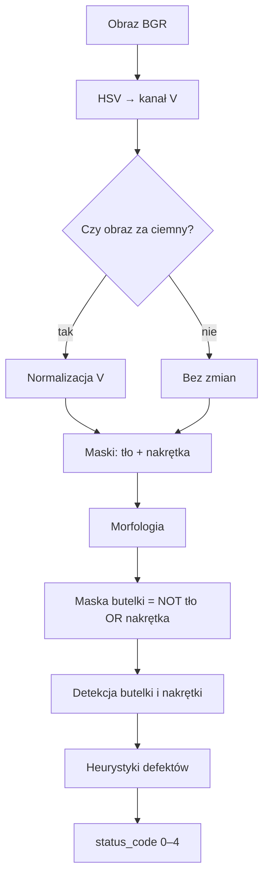
```mermaid
flowchart TD
    A[Obraz BGR] --> B[HSV → kanał V]
    B --> C{Czy obraz za ciemny?}
    C -->|tak| D[Normalizacja V]
    C -->|nie| E[Bez zmian]
    D --> F[Maski: tło + nakrętka]
    E --> F
    F --> G[Morfologia]
    G --> H[Maska butelki = NOT tło OR nakrętka]
    H --> I[Detekcja butelki i nakrętki]
    I --> J[Heurystyki defektów]
    J --> K[status_code 0–4]
```

**Etapy segmentacji:**

1. **Kanał V** — jasność jako podstawa progowania; przy ciemnych zdjęciach normalizacja do `v_normalize_target` (210).


2. **Progi V** — `bg_v_range` (0–45), `cap_v_range` (130–255); butelka metodą wykluczenia.


*Tło (czerwone), butelka (zielona), nakrętka (niebieska). Szczelina między nakrętką a szyją sygnalizuje luźne zamknięcie.*

3. **Morfologia** — trzy warianty czyszczenia masek (tło / nakrętka / butelka) usuwają szum po `inRange`.
4. **Detekcja nakrętki** — filtry pola, prostokątności; nachylenie liczone z **górnej krawędzi** konturu (nie z kąta `minAreaRect`, który ma niejednoznaczność ~90°).

### Wykrywanie defektów

| Flaga | Warunek (skrót) | Klasa |
|-------|-----------------|-------|
| `cap_missing` | brak konturu lub niski stosunek pola do convex hull | No Cap (4) |
| `ring_broken` | dwa regiony nakrętki lub duża różnica kąta krawędzi górnej/dolnej | Broken Ring (1) |
| `cap_broken` / `cap_crooked` | dziura w masce, niewypukły kształt lub nachylenie > progu | Broken Cap (0) |
| `cap_loose` | `contact_width / upper_width` < 0.85 | Loose Cap (3) |
| `ok` | brak flag | Good Cap (2) |

**Brak nakrętki** — brak jasnego regionu nakrętki; maska po morfologii jest fragmentaryczna:


**Luźna nakrętka** — czerwona linia *contact* wyraźnie krótsza od żółtej *upper width*:


Priorytet mapowania flag na klasę: brak nakrętki → pierścień → złamanie/przekrzywienie → luźna → OK.

### Flagi, klasy i parametry

Progi zgrupowane tematycznie (pełna lista w `Classical2.get_default_params()`, presety w `classical/presets/`):

| Grupa | Przykładowe klucze | Rola |
|-------|-------------------|------|
| Segmentacja V | `bg_v_range`, `cap_v_range` | podział obiektów |
| Morfologia | `kernel_size`, `erode_iter` | czyszczenie masek |
| Detekcja nakrętki | `cap_relative_area_thresh`, `cap_rectangularity_thresh` | filtrowanie konturów |
| Luźna nakrętka | `contact_band_prop`, `loose_contact_prop_thresh` | pomiar styku |
| Kształt | `cap_area_broken_thresh`, `cap_hole_area_prop_thresh` | złamanie / dziura |

**Ograniczenia:** zależność od jasności i układu kadru (jedna butelka), heurystyki dopasowane do tego datasetu, brak uczenia — augmentacja testowa silnie obniża skuteczność (potwierdzone w rozdz. 4).

Analizator udostępnia też zapis kroków pośrednich pipeline'u (`01_original.png` … `14_annotated.png`) do dokumentacji wizualnej.

---

## 3. Interfejs graficzny

Aplikacja Tkinter integruje cały workflow projektu. Uruchomienie:

```bash
python run_gui.py
```

Dziewięć zakładek tworzy liniowy pipeline: od wczytania danych, przez augmentację i trening ML, po konfigurację Classical2, porównanie wyników i eksport.

### Workflow

**Pierwsza konfiguracja:** dataset w `bottle-cap.yolov8/train/` → **Training Pipeline** → **Run Split** (jeśli brak cropów) → opcjonalnie **Run EDA**.

**Ścieżka ML:** Data Loader → Augmentation Config/Viewer → Training Pipeline (**Run Full Pipeline**) → Machine Learning → Results Comparison → Export.

**Ścieżka regułowa:** Rule-Based Config & Analyze (strojenie presetów) → Rule-Based Evaluation (batch) → Results Comparison.

| Menu | Działanie |
|------|-----------|
| File → Open results folder | otwiera `results/` |
| View → Open rule-based errors folder | błędy Classical2 |
| View → Reset Layout | reset okna 1280×860 |

### Zakładki aplikacji

#### Przygotowanie danych

**Data Loader** — wybór obrazu surowego lub cropa; metadane i podgląd. Inne zakładki korzystają z **Use Data Loader**.

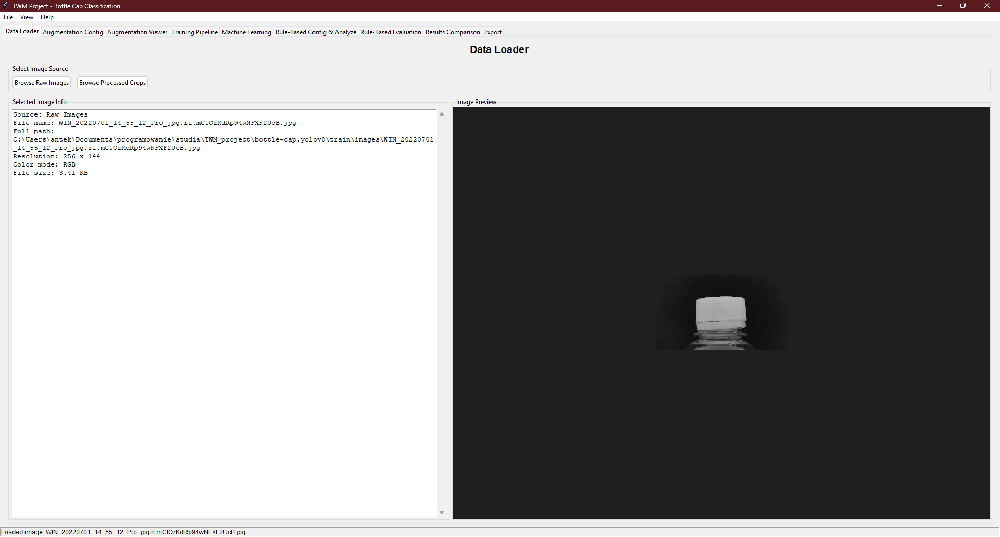

**Augmentation Config** — prawdopodobieństwa i parametry transformacji (rotacja, flip, jasność, blur, szum). Używane przy treningu ML i ewaluacji Classical2 z augmentacją.

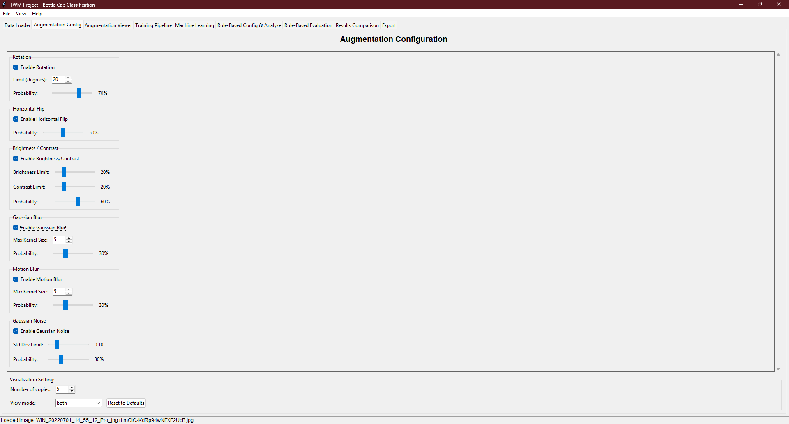

**Augmentation Viewer** — podgląd efektów pojedynczo i jako losowe kopie pipeline'u przed treningiem.

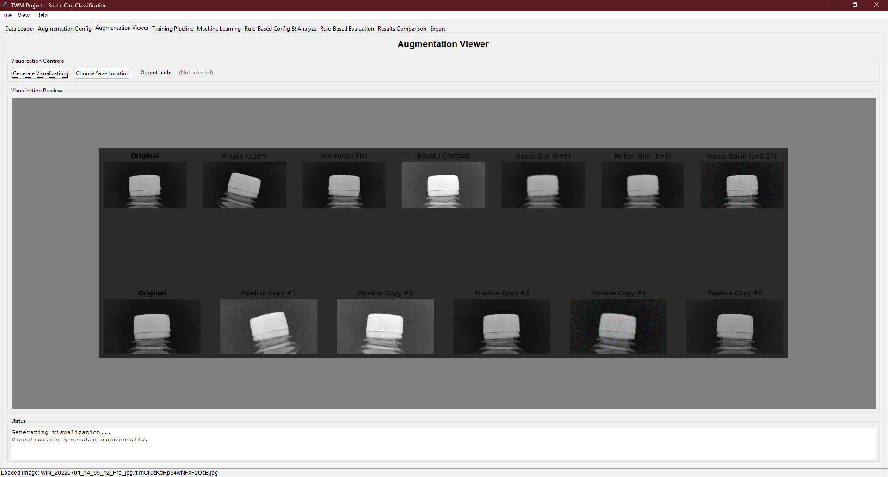

#### Trening i modele ML

**Training Pipeline** — EDA, split, trening HOG+SVM i ResNet18, opcje raw/aug/both, log operacji. Hiperparametry zapisywane do `config.py`.

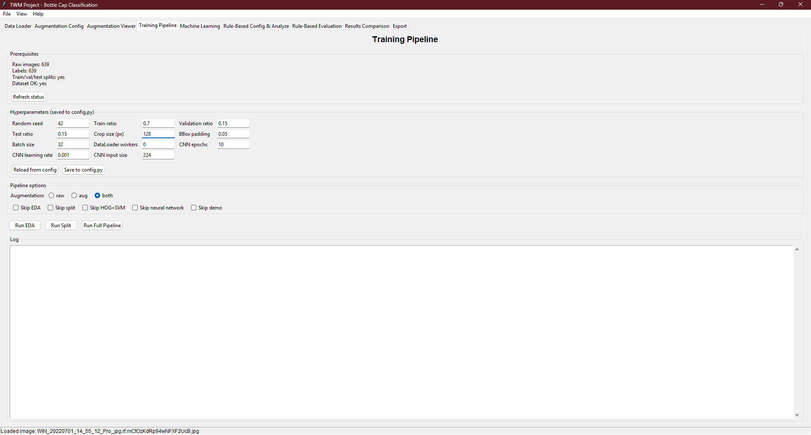

**Machine Learning** — dwa panele (HOG+SVM | ResNet18): trening, wybór runu, metryki i macierz pomyłek.

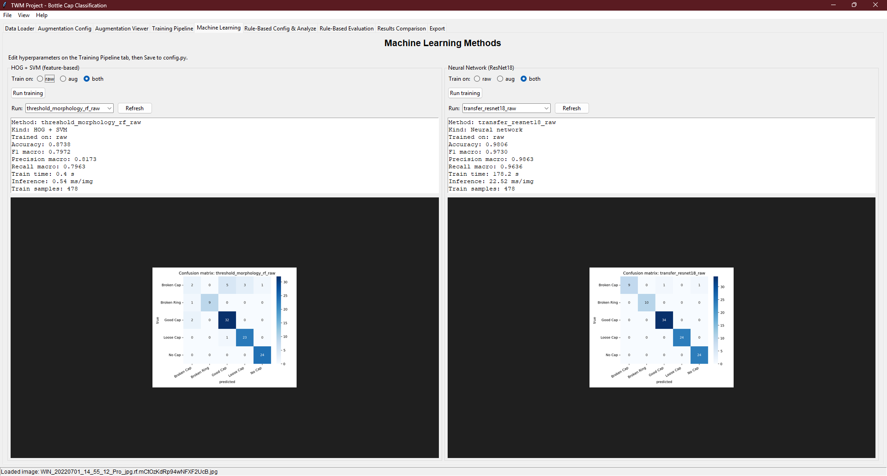

#### Metoda regułowa

**Rule-Based Config & Analyze** — edycja presetów JSON, analiza pojedynczego zdjęcia, podgląd masek i pomiarów, porównanie z etykietą datasetu. Opcja zapisu kroków pipeline'u.

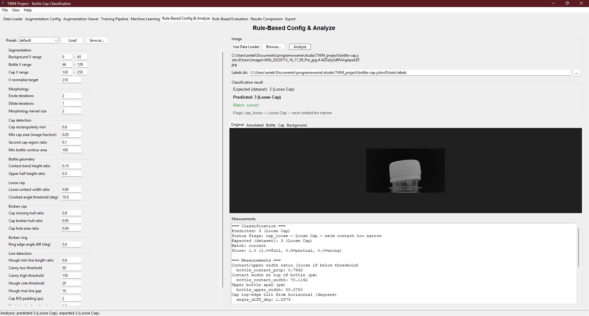

**Rule-Based Evaluation** — batch na całym zbiorze (raw/aug/both), macierz pomyłek, przeglądarka błędów z opcją re-analizy.

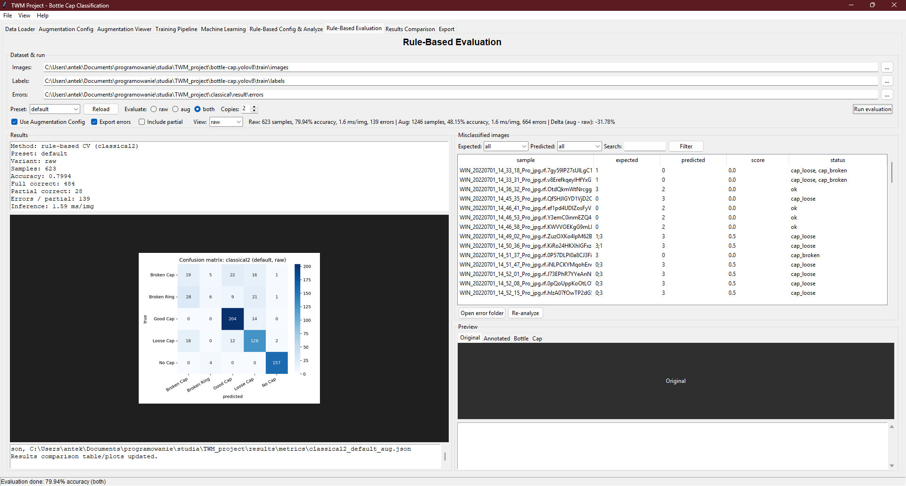

#### Porównanie i eksport

**Results Comparison** — tabela `summary.csv` i wykresy: accuracy, speed, augmentation gain, robustness.

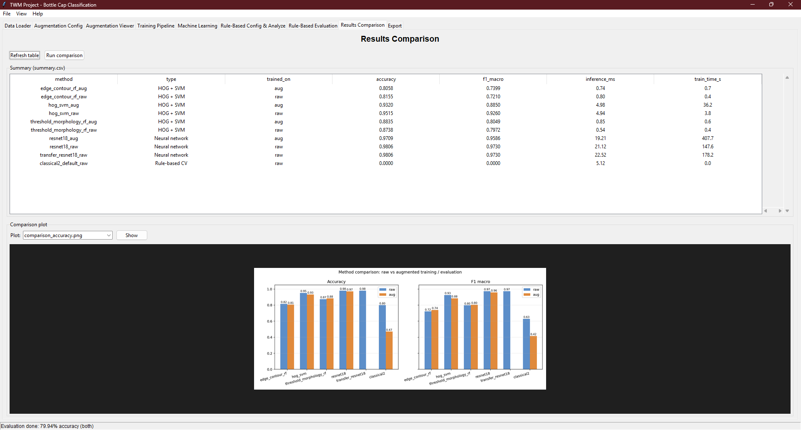

**Export** — inference na pojedynczym obrazie, demo PNG (HOG+SVM vs ResNet18), eksport ZIP wyników.

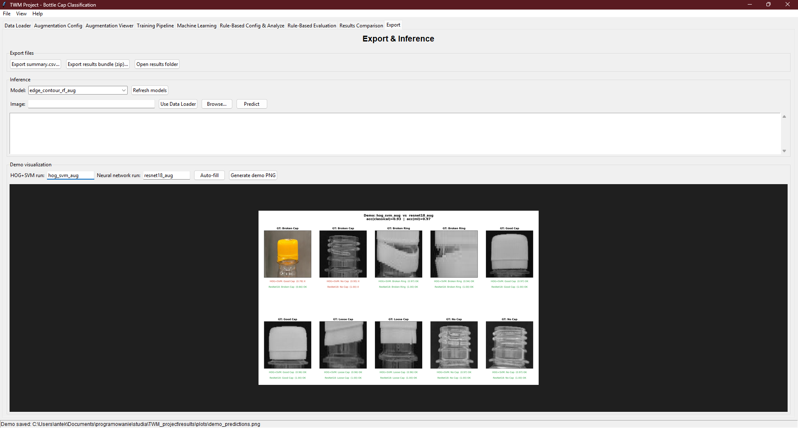

---

## 4. Wyniki eksperymentów

Eksperymenty obejmują dwie fazy: **wstępną** (pełny zbiór z outlierami) oraz **po oczyszczeniu** zbioru z nietypowych, kolorowych zdjęć. Dla każdej metody ML porównywano warianty **raw** i **aug** (sposób treningu); wykres *robustness* testuje wszystkie modele na tym samym zbiorze testowym z **sztucznymi zaburzeniami** (blur, szum, jasność) — to nie augmentacja treningowa.

### 4.1 Ewaluacja wstępna

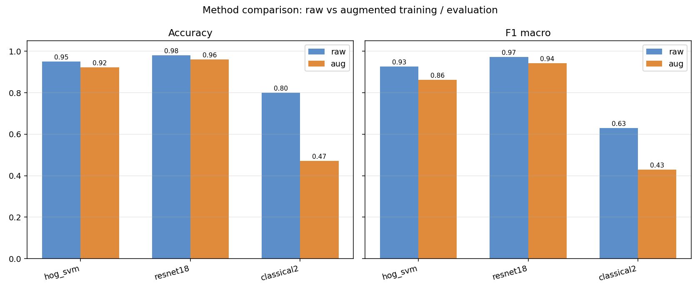

Najlepsze wyniki osiągnął **ResNet18** (~98% raw, ~96% aug). **HOG+SVM** uzyskał nieznacznie gorszą dokładność. **Classical2** osiągnął ~80% na danych raw, przy czym na zbiorze augmentowanym nastąpił gwałtowny spadek — heurystyki nie są odporne na rotację, rozmycie ani zmiany jasności wprowadzane augmentacją testową.

### 4.2 Macierze pomyłek

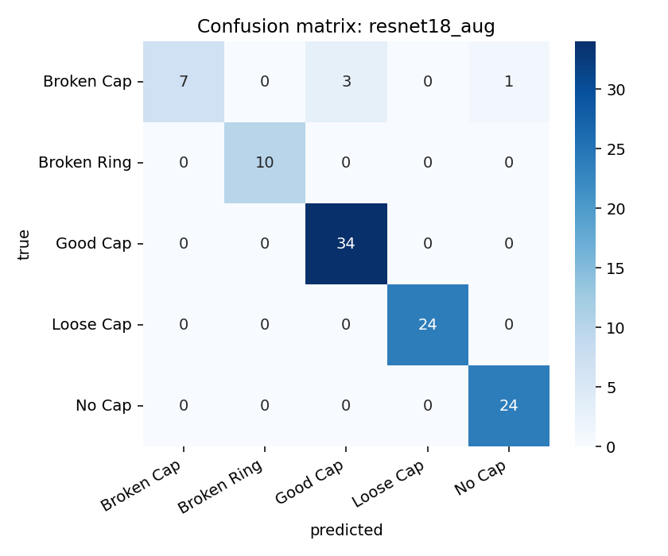

ResNet18 (aug) miał największe trudności z klasą **Broken Cap** — głównie przez kolorowe outliery w zbiorze (mała liczba przykładów, odmienna scena i orientacja). Pozostałe klasy klasyfikowane były niemal bezbłędnie.

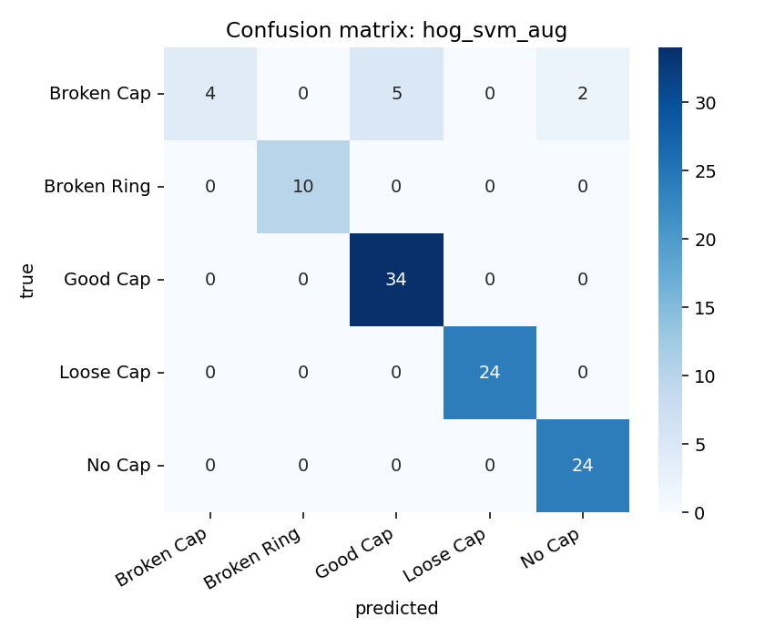

HOG+SVM wykazał podobny wzorzec: problemy z *Broken Cap*, wysoka skuteczność na pozostałych klasach.

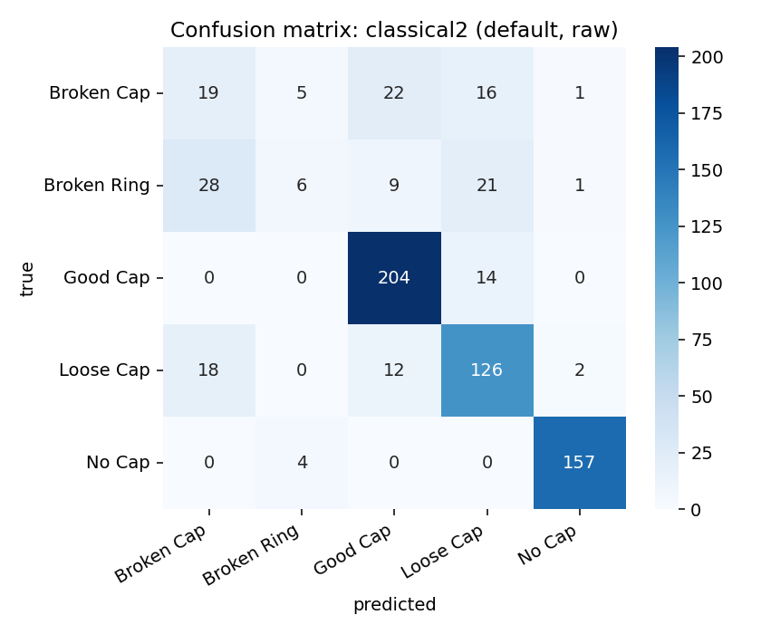

Classical2 (~80% accuracy): *Broken Cap* mylony z innymi defektami; pierwszy wiersz macierzy wskazuje na częste false negatives i false positives dla tej klasy.

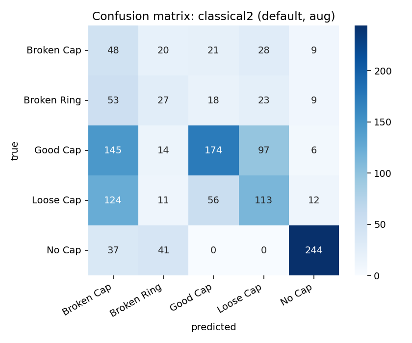

Po augmentacji testowej Classical2 spada poniżej 50% — potwierdza to słabą generalizację reguł względem zaburzeń obrazu.

### 4.3 Ewaluacja po oczyszczeniu zbioru

Usunięcie outlierów poprawiło wyniki metod uczących się:

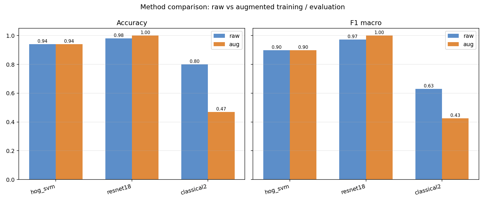

ResNet18 (aug) osiągnął **100%** na zbiorze testowym. HOG+SVM poprawił wyniki, lecz nadal myli 6 przypadków *Broken Cap*. Augmentacja treningowa nie zmieniła wyniku HOG+SVM — sugeruje to, że bottleneck leżał w reprezentacji cech, a nie w braku wariantów treningowych.

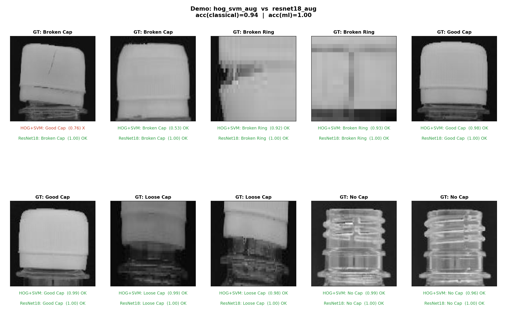

### 4.4 Augmentacja, odporność i czas inferencji

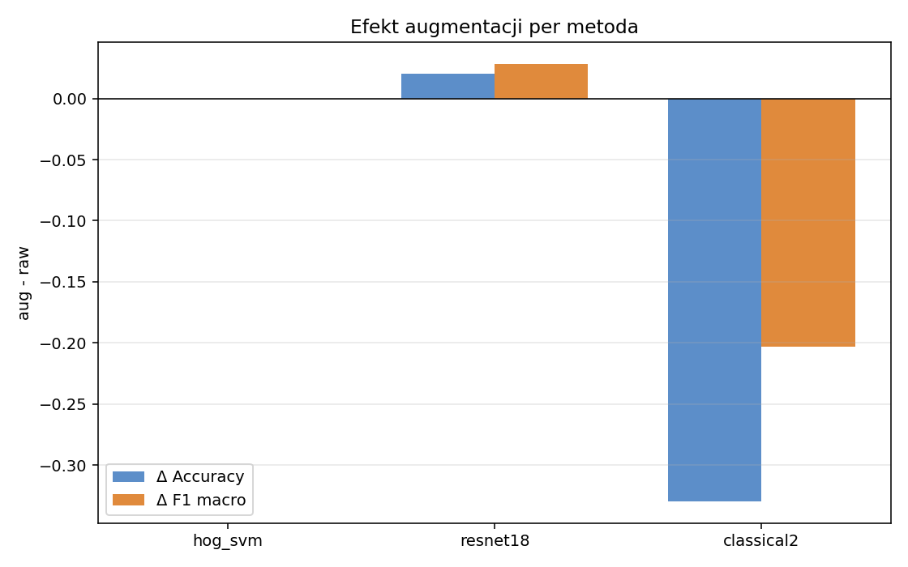

Augmentacja **treningowa** pomaga metodom uczącym się (ResNet18: wzrost do 100%), natomiast **obniża** dokładność Classical2 testowanego na augmentowanych obrazach — reguły nie uczą się na danych, tylko reagują na geometryczne i jasnościowe sygnały dopasowane do oryginalnego układu kadru.

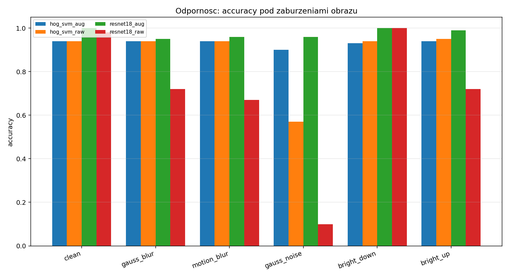

W teście odporności najtrudniejszy był **szum Gaussa** — modele `_raw` drastycznie tracą accuracy, modele `_aug` (trenowane z szumem) pozostają stabilne. Oś X to zaburzenia **testowe**, legenda `_raw`/`_aug` to sposób **treningu**.

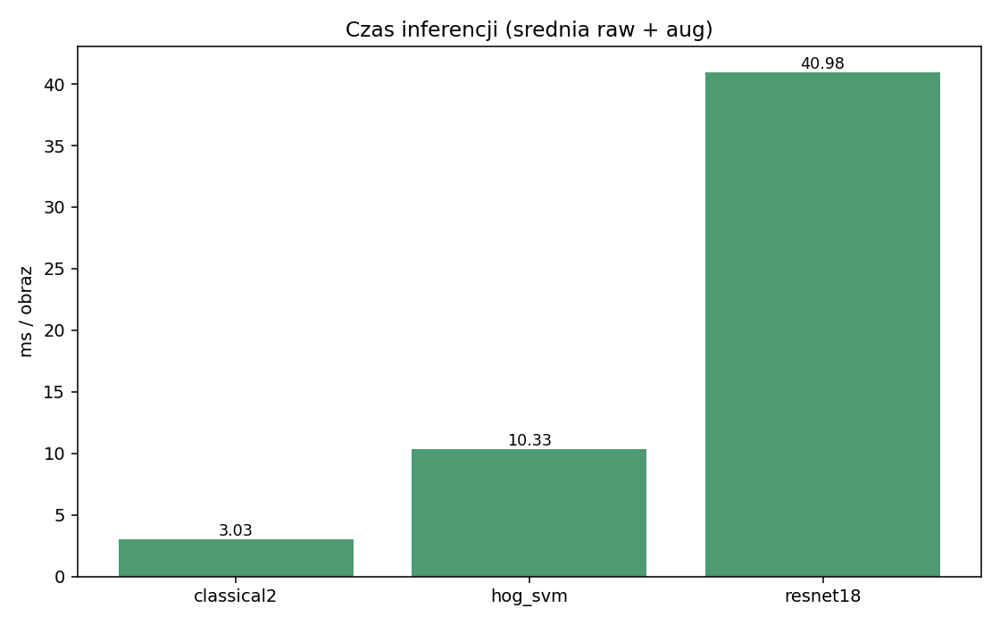

| Metoda | ~Czas / obraz |
|--------|---------------|
| Classical2 | ~3 ms |
| HOG + SVM | ~10 ms (~100 img/s) |
| ResNet18 | ~41 ms |

Classical2 jest najszybsza, ResNet18 najwolniejsza — typowy kompromis dokładność vs. latencja.

---

## 5. Podsumowanie i wnioski

**Dokładność:** Po oczyszczeniu zbioru najlepszy wynik osiąga **ResNet18 z augmentacją** (100% test accuracy). **HOG+SVM** oferuje nieznacznie gorszą dokładność przy ~4× krótszym czasie inferencji. **Classical2** osiąga ~80% na czystych danych, lecz nie konkuruje z ML i silnie traci na augmentacji oraz zaburzeniach testowych.

**Odporność:** Metody uczące się (szczególnie ResNet18 aug) dobrze radzą sobie z augmentacją treningową i testowymi zaburzeniami. Reguły geometryczne wymagają ręcznego strojenia i nie generalizują na transformacje niewidoczne w oryginalnym układzie sceny.

**Koszt utrzymania:** Classical2 wymaga wiedzy eksperckiej i czasu na presety; trudno pokryć rzadkie warianty wad. ML skaluje się lepiej przy wystarczającej liczbie reprezentatywnych przykładów — kluczowe okazało się **oczyszczenie zbioru** z outlierów.

**Wspólny problem:** klasa **Broken Cap** była najtrudniejsza we wszystkich metodach — szczególnie gdy zdjęcia znacząco odbiegały od reszty datasetu.

**Rekomendacja praktyczna:** do produkcji z wymogiem wysokiej dokładności — **ResNet18**; gdy liczy się szybkość przy akceptowalnej dokładności — **HOG+SVM**; metoda regułowa jako szybki prototyp lub punkt odniesienia, nie jako docelowe rozwiązanie przy zróżnicowanych warunkach oświetlenia i augmentacji.
